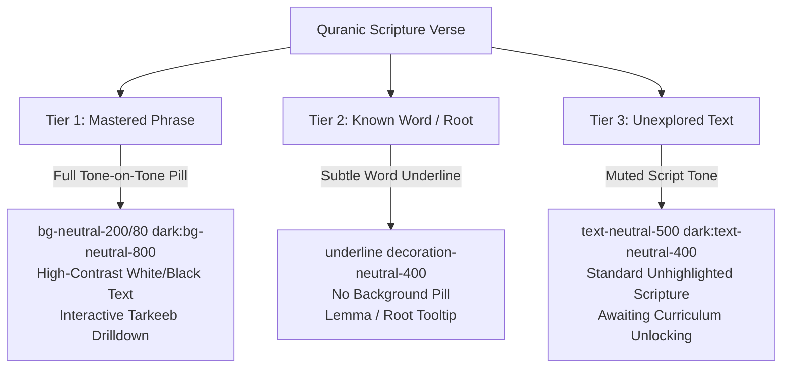

# TARIQ DESIGN SYSTEM: RAW NEUTRAL MINIMALIST ARCHITECTURE & UI GUIDELINES

**Version:** 2.0 (Permanent Codification)  
**Target Application:** Tariq (Interactive Quranic Arabic & *Esho Arbi Shikhi* Pedagogical Engine)  
**Core Principles:** Tone-on-Tone Differentiation, Zero Borders & Shadows, Generous RTL Geometry, Harakat Fading, Living Mushaf Visual Integration.

---

## 1. Core Design Philosophy: "Raw Neutral"

### Why We Rejected Gamified Cartoon Effects
Traditional digital language-learning applications (such as Duolingo, Kalaam, and standard vocabulary flashcard apps) rely heavily on gamified dopamine triggers: vibrant neon palettes (bright greens, yellows, reds), bouncy drop shadows, cartoon mascots, sound-effect-driven interruptions, and visually noisy gamification ribbons. 

In our pedagogical architecture for **Tariq**, we fundamentally reject this cartoon-gamified aesthetic in favor of a mature, tranquil, grayscale minimalism with a dignified Islamic flavor—an approach we term **Raw Neutral**.

#### Key Architectural Motivations:
1. **Reverence for Classical Quranic Text:** We are digitizing Maulana Abu Taher Misbah's acclaimed Classical Arabic curriculum, *Esho Arbi Shikhi*, leading learners to direct comprehension of the Qur'an without translation barriers. Sacred scripture and classical linguistic mechanics demand an environment of dignity, calmness, and profound intellectual focus, rather than juvenile gamified distraction.
2. **Cognitive Load Reduction:** Learning inflectional Arabic grammar (such as *I'rab*, *Idafah* possession chains, *Masdar* morphology, and syntactic *Tarkeeb* trees) involves high native mental complexity. Neon UI palettes and intrusive styling compete directly with the actual learning matter. By turning the application canvas into an invisible, neutral slate, **100% of the user's focus remains on the linguistic structures and diacritic marks**.
3. **The "Direct Method" Immersion:** True fluency requires transitioning from constant translation into thinking directly in Arabic. A quiet, high-contrast monochrome canvas fosters deep focus, allowing the learner to internalize morphological paradigms and grammar patterns organically.

---

## 2. Color & Tone Palette: Tone-on-Tone Differentiation

In the **Raw Neutral** design system, color is stripped to an absolute minimum. We utilize Tailwind CSS's calibrated `neutral` grayscale tokens (along with custom pure black/dark zinc tonal overrides) to build interface depth entirely through **Tone-on-Tone Differentiation**. 

Semantic accent colors (such as emerald primary tones or success/danger feedback states) are reserved strictly for binary functional confirmations (e.g., correct vs. incorrect quiz state feedback in [QAndAView.tsx](file:///home/amir/Documents/firstmate/projects%20/a_tariq/apps/web/src/components/pedagogy-v2/QAndAView.tsx)).

### Color Token Specifications & Hex Mapping

| Element / Layer | Tailwind Class Token | Light Mode Hex / Usage | Dark Mode Hex / Usage |
| :--- | :--- | :--- | :--- |
| **Canvas Background** | `bg-white` / `bg-black` | `#FFFFFF` (Pure White Slate) | `#000000` / `#0D0C0A` (`neutral-950` or pure black) |
| **Sticky Header Surface** | `bg-white/80` / `dark:bg-black/80` | `#FFFFFF` (80% opacity, Backdrop Blur) | `#000000` (80% opacity, Backdrop Blur) |
| **Primary Container Layer 1** | `bg-neutral-100` / `dark:bg-neutral-900` | `#F0EEE8` (Base Squircles & Content Cards) | `#1A1815` (Base Squircles & Content Cards) |
| **Elevated Child Layer 2** | `bg-white` / `dark:bg-[#141414]` | `#FFFFFF` (Nested Word Cells & Info Boxes) | `#141414` / `#161616` (Nested High-Contrast Card Cells) |
| **Interactive Tonal Hover / Layer 3**| `bg-neutral-200/80` / `dark:bg-neutral-800`| `#E5E1D8` (Flipped Flashcards, Tonal Toggles) | `#22201B` (Flipped Cards, Selected Action Pills) |
| **Primary Typography** | `text-neutral-900` / `dark:text-neutral-50` | `#1A1815` / `#0D0C0A` (High-Contrast Headers) | `#F8F7F4` / `#FFFFFF` (High-Contrast Arabic / Titles) |
| **Secondary Typography** | `text-neutral-600` / `dark:text-neutral-300`| `#7D7463` (Subtitles & English Meanings) | `#D5CEBF` (Subtitles & English Meanings) |
| **Muted Typography / Hints** | `text-neutral-500` / `dark:text-neutral-400`| `#9A8F7B` (Romanization & Instructional Hints) | `#B9AF9C` (Romanization & Instructional Hints) |
| **High-Contrast Action Targets**| `bg-neutral-900 text-white` | `#1A1815` background / `#FFFFFF` text (Primary Action)| `#FFFFFF` background / `#000000` text (Primary Action) |
| **Functional Success Feedback**| `text-status-success` / Tonal Fill | `#2E7D32` (Quiz Correct Explanation) | `#2E7D32` (Quiz Correct Explanation) |

---

## 3. Borderless & Shadowless Enforcement Rule

### The Absolute Zero Border & Zero Drop-Shadow Mandate
To maintain an unencumbered, serene learning atmosphere, our architecture enforces a strict ban on decorative separating borders and floating box-shadows:
- **PROHIBITED UTILITY CLASSES:** `border`, `border-b`, `border-t`, `border-neutral-*`, `border-[color]`, `divide-y`, `divide-x`, `shadow-sm`, `shadow`, `shadow-md`, `shadow-lg`, `shadow-xl`, `drop-shadow-*`.
- **THE EXCEPTION:** Thin internal layout connecting rods (such as linguistic branch connectors in syntactic diagrams in [TarkeebView.tsx](file:///home/amir/Documents/firstmate/projects%20/a_tariq/apps/web/src/components/pedagogy-v2/TarkeebView.tsx) or progress track lines in [LessonHeader.tsx](file:///home/amir/Documents/firstmate/projects%20/a_tariq/apps/web/src/components/pedagogy-v2/LessonHeader.tsx)) may use subtle background lines (`h-[2px] bg-neutral-200/50 dark:bg-neutral-800/50`), but NEVER outline borders around components.

### How Separation is Achieved: Tone & Gap Spacing
Container separation, card hierarchy, and click targets are achieved **100% via background tonal contrast and structural grid spacing**. When nesting cards inside a parent panel, shift the background tone by precisely one degree in the neutral palette, and rely on generous padding (`p-6`, `p-8`) and flexible spacing gaps (`space-y-4`, `space-y-6`, `gap-3`, `gap-6`).

#### ❌ INCORRECT (Traditional Gamified/Web Practice):
```tsx
// VIOLATES RAW NEUTRAL SYSTEM: Harangued with hard borders, shadows, and cartoon colors
<div className="border-2 border-green-500 bg-green-50 rounded-lg p-6 shadow-md shadow-green-200">
  <div className="border-b border-gray-300 pb-2 mb-4">
    <h3 className="font-sans font-bold text-gray-800 text-lg">Grammar Rule</h3>
  </div>
  <div className="bg-white border border-gray-200 rounded p-4 shadow-sm">
    <p className="text-gray-900">Example Arabic Text</p>
  </div>
</div>
```

#### ✅ CORRECT (Raw Neutral V2 Standard):
```tsx
// VALIDATED BY TARIQ V2 ARCHITECTURE: Tone-on-tone layering, zero borders, zero shadows, generous squircles
<div className="flex flex-col rounded-3xl bg-neutral-100 dark:bg-neutral-900 p-8 space-y-6 transition-colors">
  <div className="font-english text-xs font-semibold tracking-wider uppercase text-neutral-500 dark:text-neutral-400">
    Grammar Focus
  </div>
  <div className="flex flex-col items-center justify-center py-4 space-y-2 bg-white/60 dark:bg-[#141414]/60 rounded-2xl p-6">
    <span className="font-arabic-semibold text-3xl md:text-4xl text-neutral-950 dark:text-white leading-relaxed text-center" dir="rtl">
      هَذَا كِتَابٌ
    </span>
    <span className="font-english text-lg font-semibold text-neutral-800 dark:text-neutral-200 text-center">
      hādha kitābun
    </span>
    <span className="font-english text-sm text-neutral-500 dark:text-neutral-400 text-center">
      This is a book
    </span>
  </div>
</div>
```

---

## 4. Soft Modern Geometry: Squircles vs. Interactive Pills

Our component layout relies on a strict geometric duality that clearly signals interactivity and structural weight to the student without requiring instructions or arrows.

### 1. Squircles (Content & Structural Containers)
All passive learning blocks, vocabulary flashcard containers, verb conjugation cells, and interactive multiple-choice card options must use generous rounded squircle radiuses:
* **`rounded-3xl` (Outer Structural Panels):** Used for vocabulary flashcard wrapper boxes, grammar rule cards, application example wrappers, Q&A question containers, and paragraph lesson cards.
* **`rounded-2xl` (Nested Inner Cells & Data Matrix Rows):** Used for internal elements residing inside a `rounded-3xl` container, such as emoji/image preview wells (`w-20 h-20 rounded-2xl bg-white dark:bg-[#161616]`), morphology table cells in [MasdarFactoryView.tsx](file:///home/amir/Documents/firstmate/projects%20/a_tariq/apps/web/src/components/pedagogy-v2/MasdarFactoryView.tsx), and syntax word nodes in [TarkeebView.tsx](file:///home/amir/Documents/firstmate/projects%20/a_tariq/apps/web/src/components/pedagogy-v2/TarkeebView.tsx).

### 2. Pills (Interactive Targets & High-Contrast Triggers)
All primary user navigation controls, state toggles, reveal triggers, and badge indicators must be fully rounded pills:
* **`rounded-full` (Action Controls & Toggles):** Used exclusively for high-contrast primary buttons (e.g., *"Next Question"*, *"Reveal All"*, *"Previous/Flip Back"* in [VocabularyView.tsx](file:///home/amir/Documents/firstmate/projects%20/a_tariq/apps/web/src/components/pedagogy-v2/VocabularyView.tsx)), translation drawer toggles in [TranslationToggle.tsx](file:///home/amir/Documents/firstmate/projects%20/a_tariq/apps/web/src/components/pedagogy-v2/TranslationToggle.tsx), progress track bars in [LessonHeader.tsx](file:///home/amir/Documents/firstmate/projects%20/a_tariq/apps/web/src/components/pedagogy-v2/LessonHeader.tsx), and grammatical category badges.
* **High-Contrast Interaction Mechanics:** Active pill buttons adopt an inverted monochrome contrast that instantly differentiates them from passive containers (`bg-neutral-900 text-white dark:bg-white dark:text-black hover:opacity-90 active:scale-95`).

---

## 5. Typography & RTL Layout Tokens

Arabic orthography—especially when heavily vocalized with classical *Harakat* (Fatha, Kasra, Damma, Sukun, Shadda, Maddah, and Tanween)—has substantial vertical ascenders and descenders. Standard modern web line heights cause severe clipping, glyph collisions, and visual fatigue.

### Typography Engine Configurations
Defined natively in [tailwind.config.js](file:///home/amir/Documents/firstmate/projects%20/a_tariq/apps/web/tailwind.config.js) and applied across all V2 components:

```js
// Tailwind Configuration Schema
fontFamily: {
  english: ['Quicksand', 'sans-serif'],
  'english-medium': ['Quicksand', 'sans-serif'],
  'english-semibold': ['Quicksand', 'sans-serif'],
  arabic: ['Cairo', 'sans-serif'],
  'arabic-medium': ['Cairo', 'sans-serif'],
  'arabic-semibold': ['Cairo', 'sans-serif'],
  bengali: ['Noto Sans Bengali', 'sans-serif'], // Native curriculum support for Esho Arbi Shikhi
},
fontSize: {
  display: ['34px', { lineHeight: '40px', letterSpacing: '-0.4px' }],
  h1: ['28px', { lineHeight: '34px', letterSpacing: '-0.2px' }],
  h2: ['22px', { lineHeight: '28px', letterSpacing: '-0.1px' }],
  body: ['16px', { lineHeight: '26px' }],
  'body-sm': ['14px', { lineHeight: '22px' }],
  caption: ['12px', { lineHeight: '18px' }],
  'arabic-display': ['44px', { lineHeight: '60px' }],
  'arabic-body': ['18px', { lineHeight: '34px' }],
}
```

| Typography Role | Primary Font Family | Tailwind Font Utilities | Preferred Fallbacks |
| :--- | :--- | :--- | :--- |
| **English / UI & Grammar Admin** | **Quicksand** | `font-english`, `font-english-medium`, `font-english-semibold` | `Outfit`, `Nunito`, `sans-serif` |
| **Arabic / Classical Quranic & Vocabulary** | **Cairo** | `font-arabic`, `font-arabic-medium`, `font-arabic-semibold` | `Tajawal`, `Noto Naskh Arabic`, `Mushaf` script |
| **Bengali / Curriculum Explanations** | **Noto Sans Bengali** | `font-bengali` | `sans-serif` |

### RTL & Diacritic Buffer Rules
To ensure zero clipping of vocalic diacritics and effortless reading across mobile and web interfaces:
1. **Mandatory RTL Directionality:** Every wrapper containing Arabic script must explicitly declare `dir="rtl"` to guarantee correct bi-directional Unicode rendering and phrase punctuation alignment.
2. **Generous Line-Height Enforcement:** Never rely on browser default line heights for Arabic text. Always use tailored classes:
   - For standard vocabulary and syntax lines: apply `leading-relaxed` or `leading-loose`.
   - For continuous paragraph passages in [ParagraphView.tsx](file:///home/amir/Documents/firstmate/projects%20/a_tariq/apps/web/src/components/pedagogy-v2/ParagraphView.tsx): enforce an expansive vertical rhythm using `leading-[2.4]` (`text-2xl leading-[2.4]`).
3. **Vertical Padding Buffers:** Always apply an inner structural vertical cushion around standalone Arabic text strings (`py-1.5`, `py-2`, `py-3`, or `p-4`) as codified in [ArabicText.tsx](file:///home/amir/Documents/firstmate/projects%20/a_tariq/apps/web/src/components/pedagogy-v2/ArabicText.tsx) to prevent container bounding boxes from severing high *maddah* gestures or low *kasrah* strokes.

---

## 6. Harakat Fading & Comprehension Engine Visual Guidelines

A core pedagogical innovation of **Tariq**—adapted directly from Maulana Abu Taher Misbah's classical methodology in *Esho Arbi Shikhi*—is solving the **"Illusion of Fluency"** caused by traditional language apps that leave full vowel marks turned on indefinitely. 

Our pedagogical engine introduces systematic **Harakat Fading** and integrates user progression directly into a **Living Mushaf** visual interface.

### 1. The 5 Harakat Fading Stages
As a student advances across curriculum lessons, the rendering engine systematically peels away vowel diacritics according to 5 programmed stages:

| Stage Token | Pedagogical Stage Name | Diacritic Rules & Target State | Visual Styling & Engine Implementation |
| :--- | :--- | :--- | :--- |
| **`STAGE_0`** | **Full Vocalization** (Beginner / Intro) | Complete vowel diacritics on all characters (Fatha, Kasra, Damma, Sukun, Shadda, Tanween). Example: `كِتَابٌ`. | High-contrast font rendering (`text-neutral-950 dark:text-white font-arabic-semibold`). Full opacity on all Unicode vowel chars. |
| **`STAGE_1`** | **Ending Tanween / I'rab Fading** | Final grammatical inflectional endings (Tanween and short final vowels) are stripped or dimmed to train natural stop reading (*Waqf*) while preserving internal root vowels. Example: `كِتَاب`. | Final vowel diacritics wrapped in inline span with `opacity-50` or entirely stripped by text pipeline. |
| **`STAGE_2`** | **Pattern & Article Fading** | Highly predictable prefixes and structural morphemes (the definite article `الـ`, standard pronouns `هُوَ/هِيَ`, prepositions `فِي/مِنْ`) drop their harakat. | Structural words transition to unvoweled text; core verb/noun roots remain voweled for phonetic guidance. |
| **`STAGE_3`** | **Disambiguation / Root Only** | Only visually ambiguous homographs or irregular conjugation forms (e.g., differentiating passive `عُلִمَ` from active `عَلِمَ`, or form II `عَلَّمَ`) retain selective diacritics. | Minimum vital harakat rendered; standard narrative and conversational sentences are completely unvoweled. |
| **`STAGE_4`** | **Zero Harakat Mastery** | 100% unvoweled, authentic Arabic reading text (typical of advanced paragraphs, historical manuscripts, and native modern reading). Example: `كتاب`. | Pure unvoweled string rendered in `font-arabic-semibold text-2xl leading-[2.4]` in [ParagraphView.tsx](file:///home/amir/Documents/firstmate/projects%20/a_tariq/apps/web/src/components/pedagogy-v2/ParagraphView.tsx). |

---

### 2. The "Living Mushaf" 3-Tier Comprehension Highlights
The **Living Mushaf** module links the user's mastered vocabulary and grammar syntax from *Esho Arbi Shikhi* directly to Quranic scripture. Instead of presenting a simple translated Qur'an, verses are visually segmented into a **3-Tier Tonal Hierarchy** based on the learner's dynamic mastery profile.



#### Tier 1: Mastered Phrases (Full Syntax & Vocab Mastery)
* **Definition:** The user has mastered both the vocabulary words and the governing syntactic rule (e.g., a complete *Idafah* possessive phrase or a complete *Tarkeeb* sentence structure present in the verse).
* **Visual Styling:** Illuminated as a prominent **Tone-on-Tone Interactive Squircle Pill**. It stands out invitingly from the surrounding canvas without resorting to loud colors.
* **Class Utilities:** `rounded-2xl bg-neutral-200/80 dark:bg-neutral-800 px-3.5 py-1 text-neutral-950 dark:text-white font-arabic-semibold transition-all hover:bg-neutral-300/80 dark:hover:bg-neutral-700 cursor-pointer`.
* **Interaction:** Tapping a Tier 1 pill opens a modal presenting the verified grammatical tree (*Tarkeeb*) and exact book lesson reference that taught the structure.

#### Tier 2: Known Roots & Vocabulary (Partial Mastery)
* **Definition:** The learner has drilled the individual word lemma or triliterate root in vocabulary sessions (e.g., via [VocabularyView.tsx](file:///home/amir/Documents/firstmate/projects%20/a_tariq/apps/web/src/components/pedagogy-v2/VocabularyView.tsx)), but the complex syntax or rhetorical device connecting it in this verse has not yet been taught.
* **Visual Styling:** Highlighted with a **Subtle Monochrome Underline and Medium Contrast**, without any background container fill.
* **Class Utilities:** `underline decoration-neutral-400 dark:decoration-neutral-600 decoration-2 underline-offset-8 font-arabic-medium text-neutral-800 dark:text-neutral-200 hover:text-neutral-950 dark:hover:text-white transition-colors cursor-pointer`.
* **Interaction:** Tapping a Tier 2 word shows a compact flashcard preview revealing the known root meaning and romanization, with a subtle note on which future chapter explains the full verse grammar.

#### Tier 3: Unexplored Text (Standard Scripture)
* **Definition:** Words and syntactic concepts that lie ahead in future volumes or unreached chapters of the curriculum.
* **Visual Styling:** Rendered in a **Muted, Restful Scripture Tone**. No backgrounds, no borders, no underlines. This intentional demotion prevents visual noise and cognitive overwhelm, allowing the learner's eyes to focus celebrate and recognize the illuminated pieces of the Qur'an they already own.
* **Class Utilities:** `text-neutral-500 dark:text-neutral-400 font-arabic font-normal opacity-75`.
* **Interaction:** Passive reading text; tapping prompts an inviting note: *"Keep progressing in Esho Arbi Shikhi to illuminate this revelation!"*

---

## 7. Component Reference Registry (V2 Architecture)

The following core components in `apps/web/src/components/pedagogy-v2/` implement these exact permanent guidelines and serve as the golden prototypes for all future interface expansion:

1. **[VocabularyView.tsx](file:///home/amir/Documents/firstmate/projects%20/a_tariq/apps/web/src/components/pedagogy-v2/VocabularyView.tsx):** Implements borderless tone-on-tone flashcard squircles (`rounded-3xl bg-neutral-100 dark:bg-neutral-900`), interactive flip physics, emoji/image wells, progress indicator dots, and inverted high-contrast action pills (`rounded-full bg-neutral-900 text-white`).
2. **[GrammarRuleView.tsx](file:///home/amir/Documents/firstmate/projects%20/a_tariq/apps/web/src/components/pedagogy-v2/GrammarRuleView.tsx):** Demonstrates multi-layer tone-on-tone hierarchy without borders. Parent containers use `bg-neutral-100 dark:bg-neutral-900`, nested example wells use `bg-white/60 dark:bg-[#141414]/60` and generous Quicksand captions.
3. **[IdafahView.tsx](file:///home/amir/Documents/firstmate/projects%20/a_tariq/apps/web/src/components/pedagogy-v2/IdafahView.tsx):** Features two-column interactive possessive chain drills. Uses high-contrast state transitions upon tapping to reveal possessed terms (`bg-neutral-900 text-white dark:bg-white dark:text-black`).
4. **[MasdarFactoryView.tsx](file:///home/amir/Documents/firstmate/projects%20/a_tariq/apps/web/src/components/pedagogy-v2/MasdarFactoryView.tsx) & [VerbTableView.tsx](file:///home/amir/Documents/firstmate/projects%20/a_tariq/apps/web/src/components/pedagogy-v2/VerbTableView.tsx):** Showcases horizontally scrollable, zero-border conjugation data tables using pure background tone distinction between root headers (`bg-neutral-200/80 dark:bg-neutral-800`) and derived conjugations (`bg-white dark:bg-[#141414]`).
5. **[TarkeebView.tsx](file:///home/amir/Documents/firstmate/projects%20/a_tariq/apps/web/src/components/pedagogy-v2/TarkeebView.tsx):** Illustrates complex tree diagram visualization using tone-on-tone word squircles (`rounded-2xl px-5 py-3.5 bg-white dark:bg-[#151515]`) connected by minimal `2px` neutral guide rods.
6. **[QAndAView.tsx](file:///home/amir/Documents/firstmate/projects%20/a_tariq/apps/web/src/components/pedagogy-v2/QAndAView.tsx):** Interactive testing engine with immediate answer feedback. Option squircle selection dynamically shifts opacity and contrast tones rather than using harsh colored outlines.
7. **[ParagraphView.tsx](file:///home/amir/Documents/firstmate/projects%20/a_tariq/apps/web/src/components/pedagogy-v2/ParagraphView.tsx):** Pure reading immersion block demonstrating unvoweled and voweled Arabic typography with generous line height (`leading-[2.4]`) and pill-based translation toggle drawers.
8. **[LessonHeader.tsx](file:///home/amir/Documents/firstmate/projects%20/a_tariq/apps/web/src/components/pedagogy-v2/LessonHeader.tsx):** Sticky header showcasing backdrop blur (`backdrop-blur-md bg-white/80 dark:bg-black/80`), circular icon targets, and a borderless spring-animated progress bar.

---
*End of Design System Reference Specification. Keep this document intact across all future development and AI context windows.*
