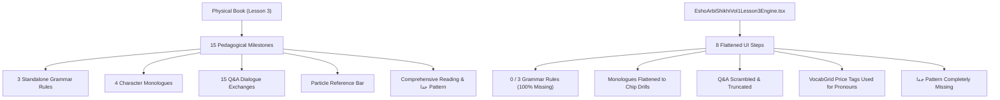

# Pedagogical Audit: Lesson 3 (الدرس الثالث - তৃতীয় পাঠ)
**Source Pages**: `resources/pages/vol1/page-023.png` through `page-026.png`  
**Target Code**: `apps/web/src/components/curriculum/EshoArbiShikhiVol1Lesson3Engine.tsx`  
**Audit Date**: August 2026  
**Auditor**: Antigravity Pedagogical Audit Subsystem  

---

## Executive Summary

A brutal line-by-line pedagogical comparison between the physical textbook (*Esho Arbi Shikhi* Vol 1, Lesson 3) and `EshoArbiShikhiVol1Lesson3Engine.tsx` reveals severe structural and content defects:

1. **Content Omission (~90% Loss)**: All 3 standalone grammar rules in Lesson 3 are completely missing. 4 structured character monologues, the particle reference bar, the negative correction pattern (`لا .. بل`), and the `جدا` (intensity) pattern exercises are omitted or broken into generic disconnected chips.
2. **Chronological Scrambling**: The physical book introduces vocabulary and grammar in synchronized pedagogical waves. The current engine scrambles these waves, merging Vocabulary Block 1 (p. 23) and Vocabulary Block 2 (p. 25) into a single initial step, stripping adjectives into a separate Step 4, and destroying the step-by-step progression.
3. **UI Anti-Patterns & "Price Tag" Grid Misuse**: `VocabGrid` is forced onto personal pronouns and text-only items. Cards display metadata headers like `Card 01`, `Card 02` with checkmarks, resembling an e-commerce price tag layout rather than structured Arabic pedagogical material.
4. **Destruction of Monologues and Dialogues**: Narrative self-introductions (Bilal and Ayesha speaking about themselves) and third-person descriptions (Rashid and Fatima describing others) are turned into arbitrary word-chip assembly lines without narrative context.

---

## Physical Page-by-Page Inventory vs. Current Implementation

### Page 23 (`page-023.png`)

| Physical Book Segment | Content in Physical Book | Status in Current Code | Audit Finding / Violation |
|---|---|---|---|
| **Header** | `الدرس الثالث` / `তৃতীয় পাঠ` | Present in Header | Correctly mapped in top banner. |
| **Vocab Block 1: People & Gender Pairs** | Pairs: `تِلْمِيذٌ` / `تِلْمِيذَةٌ`, `مُعَلِّمٌ` / `مُعَلِّمَةٌ`, `وَلَدٌ` / `بِنْتٌ`, `طِفْلٌ - طِفْلَةٌ` + `مُؤَدَّبٌ` | Crammed in `vocabPeople` (Step 0) | Scrambled. Merged with Page 25 vocabulary (`تَاجِرٌ`, `فَلَّاحٌ`, `رَجُلٌ`, `امْرَأَةٌ`) into one 11-card grid. |
| **Boxed Pronouns Section** | Table of Pronouns: `أَنَا` (আমি), `أَنْتَ - أَنْتِ` (তুমি), `هُوَ - هِيَ` (সে) | Rendered in `vocabPronouns` (Step 1) | **UI Anti-Pattern**: Rendered in `VocabGrid` as "Card 12", "Card 13", "Card 14" with price-tag styling. Loses 1st/2nd/3rd person structure. |
| **Grammar Rule Box 1: Diptote Nouns (Gendered Proper Noun Endings)** | Box note: Male names take Tanween (`مَحْمُودٌ`, `رَاشِدٌ`, `خَالِدٌ`, `سَعِيدٌ`), Female names do NOT take Tanween (`خَدِيجَةُ`, `فَرْحَانَةُ`, `فَاطِمَةُ`, `عَائِشَةُ`). | **COMPLETELY MISSING** | **100% Omission**. Zero representation of this core grammatical rule in code or data. |
| **Initial Sentence Patterns** | `أَنَا تِلْمِيذٌ` (আমি ছাত্র) & `أَنَا تِلْمِيذٌ جَدِيدٌ` (আমি নতুন ছাত্র) | Partially in `translationDrill1` | Hidden inside word-chip exercise. No visual demonstration of progressive phrase expansion. |
| **Self-Introduction Monologue 1: Bilal** | Subheading: "বেলাল নিজের সম্পর্কে বলছে –"<br>`أَنَا بِلَالٌ – أَنَا تِلْمِيذٌ – أَنَا تِلْمِيذٌ جَدِيدٌ – أَنَا وَلَدٌ مُؤَدَّبٌ .` | Fragmented in `translationDrill1` | Narrative context ("Bilal is talking about himself") is destroyed. Split into standalone chip exercises. |
| **Self-Introduction Monologue 2: Ayesha** | Subheading: "আয়েশা নিজের সম্পর্কে বলছে –"<br>`أَنَا عَائِشَةُ – أَنَا تِلْمِيذَةٌ – أَنَا تِلْمِيذَةٌ جَدِيدَةٌ – أَنَا بِنْتٌ مُؤَدَّبَةٌ .` | Fragmented in `translationDrill1` | Narrative context ("Ayesha is talking about herself") is destroyed. Split into standalone chip exercises. |

---

### Page 24 (`page-024.png`)

| Physical Book Segment | Content in Physical Book | Status in Current Code | Audit Finding / Violation |
|---|---|---|---|
| **3rd Person Monologue: Rashid on Bilal** | Subheading: "রাশেদ বেলাল সম্পর্কে বলছে –"<br>`هُوَ بِلَالٌ – هُوَ تِلْمِيذٌ – هُوَ تِلْمِيذٌ جَدِيدٌ – هُوَ وَلَدٌ مُؤَدَّبٌ .` | Fragmented in `translationDrill2` | Narrative title ("Rashid is talking about Bilal") is missing. Rendered as isolated sentence chips. |
| **3rd Person Monologue: Fatima on Ayesha** | Subheading: "ফাতেমা আয়েশা সম্পর্কে বলছে –"<br>`هِيَ عَائِشَةُ – هِيَ تِلْمِيذَةٌ – هِيَ تِلْمِيذَةٌ جَدِيدَةٌ – هِيَ بِنْتٌ مُؤَدَّبَةٌ .` | Fragmented in `translationDrill2` | Narrative title ("Fatima is talking about Ayesha") is missing. Rendered as isolated sentence chips. |
| **Mixed Sentence Pattern Reading Grid** | 8 descriptive sentences:<br>`بِلَالٌ تِلْمِيذٌ جَدِيدٌ`, `مَاجِدٌ مُعَلِّمٌ جَيِّدٌ`, `زَيْنَبُ بِنْتٌ صَغِيرَةٌ`, `فَرْحَانَةُ مُعَلِّمَةٌ جَدِيدَةٌ`, `مَحْمُودٌ طِفْلٌ جَمِيلٌ`, `فَاطِمَةُ طِفْلَةٌ جَمِيلَةٌ`, `خَالِدٌ وَلَدٌ مُؤَدَّبٌ`, `خَدِيجَةُ بِنْتٌ مُؤَدَّبَةٌ` | **COMPLETELY MISSING** | **100% Omission**. This vital reading flow section between monologues and Q&A is entirely skipped. |
| **Grammar Rule Box 2: Vocative Particle (يا - Harf an-Nida Rule)** | Boxed transformation pairs:<br>`وَلَدٌ` ➔ `يَا وَلَدُ !`<br>`بِلَالٌ` ➔ `يَا بِلَالُ !`<br>`بِنْتٌ` ➔ `يَا بِنْتُ !`<br>`زَيْنَبُ` ➔ `يَا زَيْنَبُ !` | **COMPLETELY MISSING** | **100% Omission**. Explains why Tanween drops when calling someone with `يا`. Missing entirely from engine and data. |
| **Negative Response Pattern (`لا .. بل`)** | Pattern demonstration:<br>`هَلْ أَنْتَ مُعَلِّمٌ ؟` ➔ `لَا .. بَلْ أَنَا تِلْمِيذٌ` | Embedded in `qaDrill` | Hides the core structural concept (`لا .. بل` = "No, rather...") inside a generic chip builder without explanation. |
| **Dialogue Practice 1 (5 Q&A Pairs)** | Questions & Answers:<br>1. `مَنْ أَنْتَ يَا وَلَدُ ؟` ➔ `أَنَا بِلَالٌ`<br>2. `هَلْ أَنْتَ تِلْمِيذٌ ؟` ➔ `نَعَمْ .. أَنَا تِلْمِيذٌ`<br>3. `هَلْ أَنْتَ تِلْمِيذٌ جَدِيدٌ ؟` ➔ `نَعَمْ .. أَنَا تِلْمِيذٌ جَدِيدٌ`<br>4. `مَنْ أَنْتِ يَا بِنْتُ ؟` ➔ `أَنَا زَيْنَبُ`<br>5. `هَلْ أَنْتِ بِنْتٌ صَغِيرَةٌ ؟` ➔ `نَعَمْ .. أَنَا بِنْتٌ صَغِيرَةٌ` | Partially in `qaDrill` | Scrambled sequence. Q3 (`هَلْ أَنْتَ تِلْمِيذٌ جَدِيدٌ ؟`) is missing. |
| **Particle Quick Reference Bar** | Bottom vocabulary bar:<br>`هَلْ ؟` (কি?), `نَعَمْ` (হ্যাঁ), `لَا` (না), `بَلْ` (বরং), `مَنْ ؟` (কে?), `وَ` (এবং) | **COMPLETELY MISSING** | **100% Omission**. Key particle reference panel at bottom of page 24 is completely omitted. |

---

### Page 25 (`page-025.png`)

| Physical Book Segment | Content in Physical Book | Status in Current Code | Audit Finding / Violation |
|---|---|---|---|
| **Dialogue Practice 2 (10 Q&A Pairs)** | 10 complex Q&A pairs including `لا .. بل` and alternative answer formats in parentheses (e.g. `نعم .. هي معلمة جديدة`). | Scrambled / Truncated | Only 3 of 10 exchanges are in `qaDrill`. All alternative pronoun responses in parentheses are omitted. |
| **Vocab Block 2: Professions & Qualities** | Words: `تَاجِرٌ` / `فَلَّاحٌ`, `غَنِيٌّ` / `فَقِيرٌ`, `ذَكِيٌّ` / `غَبِيٌّ`, `رَجُلٌ` / `امْرَأَةٌ` | Scrambled across steps | Nouns moved to Step 0 (`vocabPeople`), adjectives moved to Step 4 (`vocab_adjectives`). Disconnects learning from context. |
| **Grammar Rule Box 3: Hamzatul Wasl in `امرأة`** | Rule Note: When preceded by a word, Alif in `امْرَأَةٌ` is written but silent (`هِيَ امْرَأَةٌ` ➔ *hiya-mra'atun*). | **COMPLETELY MISSING** | **100% Omission**. Phonetic and writing rule is omitted. |

---

### Page 26 (`page-026.png`)

| Physical Book Segment | Content in Physical Book | Status in Current Code | Audit Finding / Violation |
|---|---|---|---|
| **Comprehensive Reading Passage** | 8 compound contrasting sentences combining conjunction `وَ` with adjectives (`أَنَا مَاجِدٌ وَ أَنْتَ بِلَالٌ...`, `مَحْمُودٌ تَاجِرٌ غَنِيٌّ وَ أَنَا فَلَّاحٌ فَقِيرٌ...`). | Truncated in `readingDrill` | Only 4 lines included. Compound contrast structure is broken into isolated English chips. |
| **Passage Comprehension Q&A** | 2 comprehension questions on the text (`هَلْ مَحْمُودٌ تَاجِرٌ ؟`, `هَلْ زَيْنَبُ تِلْمِيذَةٌ غَبِيَّةٌ ؟`). | **COMPLETELY MISSING** | **100% Omission**. Omitted from engine reading step. |
| **Adverb of Degree Pattern (`جِدًّا` - Very)** | Intensity pattern practice:<br>`امْرَأَةٌ` ➔ `أَنْتِ امْرَأَةٌ ذَكِيَّةٌ جِدًّا` ➔ `عَائِشَةُ امْرَأَةٌ ذَكِيَّةٌ جِدًّا`<br>`سَعِيدٌ رَجُلٌ شَرِيفٌ جِدًّا` ➔ `هُوَ غَنِيٌّ جِدًّا` | **COMPLETELY MISSING** | **100% Omission**. The key adverbial concept `جدا` is nowhere in the code or data for Lesson 3. |

---

## Summary of Major Pedagogical Defects



---

## Proposed Custom React Components

To fix these defects, we must eliminate the misuse of `VocabGrid` and create 7 custom React components tailored to the pedagogical requirements of *Esho Arbi Shikhi*:

### 1. `GrammarRuleCard` (For Diptotes & Hamzatul Wasl)
A highlighted callout box with header icon, rule summary in Bangla/English, side-by-side contrast grid, and pronunciation guidance.

```tsx
interface GrammarRuleCardProps {
  titleAr: string;
  titleBn: string;
  ruleDescriptionBn: string;
  ruleDescriptionEn: string;
  masculineExamples: { ar: string; bn: string }[];
  feminineExamples: { ar: string; bn: string }[];
}
```
*Visual Design*: Dark green/gold themed container with rounded borders, displaying masculine nouns with red highlighted Tanween (`ٌ`) vs feminine nouns with blue highlighted single Dammah (`ُ`).

### 2. `TransformationRuleBox` (For Harf an-Nida `يَا`)
Designed specifically for rule transformations showing "Before `يا`" vs "After `يا`" with directional arrows.

```tsx
interface TransformationPair {
  beforeAr: string; // e.g. "بِلَالٌ"
  afterAr: string;  // e.g. "يَا بِلَالُ !"
  meaningBn: string; // e.g. "হে বেলাল!"
}

interface TransformationRuleBoxProps {
  title: string;
  explanationBn: string;
  pairs: TransformationPair[];
}
```
*Visual Design*: Interactive cards where clicking "Before" highlights Tanween, and clicking "After" animates the transition to Dammah when `يَا` is attached.

### 3. `PronounMatrix` (Replacing `VocabGrid` for Pronouns)
A structured 2D/3D matrix organizing personal pronouns by Grammatical Person (1st, 2nd, 3rd) and Gender (m/f).

```tsx
interface PronounMatrixProps {
  pronouns: {
    person: '1st' | '2nd' | '3rd';
    masculine: { ar: string; en: string; bn: string; translit: string };
    feminine?: { ar: string; en: string; bn: string; translit: string };
  }[];
}
```
*Visual Design*: Clean tabular layout with person tabs (First Person, Second Person, Third Person), eliminating generic "Card 01" price tag headers.

### 4. `NarrativeMonologueCard` (For Bilal & Ayesha Introductions)
Character-driven narrative container with avatar, speaker header, sentence chain reading view, audio controls, and line-by-line translation toggle.

```tsx
interface NarrativeMonologueCardProps {
  characterNameBn: string; // e.g. "বেলাল নিজের সম্পর্কে বলছে"
  avatarEmoji: string;    // e.g. "👦"
  sentences: { ar: string; en: string; bn: string }[];
}
```
*Visual Design*: Speech bubble layout with prominent Arabic font, allowing the learner to listen to the full uninterrupted narrative flow before drilling individual sentences.

### 5. `ParticleBar` (Bottom Quick Reference Bar)
A sticky or embedded reference widget displaying essential particles with audio and quick tooltips.

```tsx
interface ParticleItem {
  ar: string;
  bn: string;
  en: string;
  type: 'interrogative' | 'affirmative' | 'negative' | 'conjunction';
}
```
*Visual Design*: Elegant chip bar at the bottom of dialogue steps showing `هَلْ`, `نَعَمْ`, `لَا`, `بَلْ`, `مَنْ`, `وَ` with color-coded category badges.

### 6. `DialogueFlowEngine` (For Q&A & `لا .. بل` Pattern)
Interactive multi-turn dialogue view showing speaker 1 (Questioner) and speaker 2 (Respondent), highlighting key answer particles like `لا .. بل`.

```tsx
interface DialoguePair {
  speaker1Ar: string;
  speaker1En: string;
  speaker2Ar: string;
  speaker2En: string;
  highlightPattern?: string; // e.g. "لَا .. بَلْ"
}
```

### 7. `IntensityPatternCard` (For Adverb `جِدًّا`)
Specialized pattern component demonstrating how `جِدًّا` modifies adjectives (`ذَكِيَّةٌ` ➔ `ذَكِيَّةٌ جِدًّا`).

---

## Proposed Chronological Step Flow for Revised Engine

To restore 100% pedagogical fidelity, the revised `EshoArbiShikhiVol1Lesson3Engine` should feature **12 distinct, chronologically accurate steps**:

| Step Index | Step ID | Component | Description / Book Mapping |
|---|---|---|---|
| **Step 1** | `vocab_people` | `VocabGrid` (Cleaned) | Page 23 Vocab Block 1 (`تِلْمِيذٌ`, `مُعَلِّمٌ`, `وَلَدٌ`, `بِنْتٌ`, `طِفْلٌ`, `مُؤَدَّبٌ`). |
| **Step 2** | `pronoun_matrix` | `PronounMatrix` | Page 23 Boxed Pronouns (`أَنَا`, `أَنْتَ/أَنْتِ`, `هُوَ/هِيَ`). |
| **Step 3** | `rule_gender_names` | `GrammarRuleCard` | Page 23 Grammar Rule 1 (Diptote female names vs male Tanween). |
| **Step 4** | `self_monologues` | `NarrativeMonologueCard` | Page 23 Self-Introductions (Bilal & Ayesha monologues). |
| **Step 5** | `third_monologues` | `NarrativeMonologueCard` | Page 24 3rd Person Descriptions (Rashid on Bilal, Fatima on Ayesha). |
| **Step 6** | `reading_patterns_1` | `InteractiveDrill` | Page 24 Section `***` (8 descriptive practice sentences). |
| **Step 7** | `rule_harf_nida` | `TransformationRuleBox` | Page 24 Grammar Rule 2 (Vocative `يَا` dropping Tanween). |
| **Step 8** | `qa_dialogue_1` | `DialogueFlowEngine` + `ParticleBar` | Page 24 Q&A Dialogue Part 1 (5 exchanges + particle reference bar). |
| **Step 9** | `qa_dialogue_2` | `DialogueFlowEngine` | Page 25 Q&A Dialogue Part 2 (10 exchanges including `لا .. بل`). |
| **Step 10** | `vocab_professions` | `VocabGrid` (Cleaned) | Page 25 Vocab Block 2 (`تَاجِرٌ`, `فَلَّاحٌ`, `غَنِيٌّ`, `فَقِيرٌ`, `ذَكِيٌّ`, `غَبِيٌّ`, `رَجُلٌ`, `امْرَأَةٌ`). |
| **Step 11** | `rule_imraah` | `GrammarRuleCard` | Page 25 Grammar Rule 3 (Hamzatul Wasl in `امْرَأَةٌ`). |
| **Step 12** | `passage_and_jiddan` | `IntensityPatternCard` & Passage | Page 26 Compound reading passage, comprehension Q&A, and `جِدًّا` intensity drills. |

---

## Conclusion & Action Plan

The current implementation of Lesson 3 in `EshoArbiShikhiVol1Lesson3Engine.tsx` requires a complete overhaul:
1. **Data Restructuring**: Update `packages/shared/data/vol1/ch1/lesson03.ts` to include all missing grammar rules, monologues, dialogues, and `جدا` patterns.
2. **Component Creation**: Build `GrammarRuleCard`, `TransformationRuleBox`, `PronounMatrix`, `NarrativeMonologueCard`, `ParticleBar`, and `IntensityPatternCard`.
3. **Engine Re-assembly**: Reconstruct `EshoArbiShikhiVol1Lesson3Engine.tsx` following the 12-step chronological flow detailed above.
