# Pedagogical Audit: Lesson 4 (الدرس الرابع - চতুর্থ পাঠ)
**Source Pages**: `resources/pages/vol1/page-027.png` through `page-031.png` (Textbook Pages 29–33)  
**Target Code**: `apps/web/src/components/curriculum/EshoArbiShikhiVol1Lesson4Engine.tsx`  
**Audit Date**: August 2026  
**Auditor**: Antigravity Pedagogical Audit Subsystem  

---

## Executive Summary

A line-by-line pedagogical comparison between the physical textbook (*Esho Arbi Shikhi* Vol 1, Lesson 4) and `EshoArbiShikhiVol1Lesson4Engine.tsx` reveals critical structural, content, and UI architectural flaws:

1. **Content Loss (~90% Omission)**: The current implementation completely ignores the central grammatical breakthroughs of Lesson 4. The 2 standalone grammar rules (Solar/Lunar letters and `امرأة` -> `المرأة`), the core structural diagram contrasting `هذا كتاب` (Sentence) vs `هذا الكتاب` (Demonstrative phrase) vs `هذا الكتاب جميل` (Complete sentence with definite subject), all 4 illustrated building panels (Book, School, Mosque, Clock), and over 25+ reading drill sentences are missing.
2. **Chronological Scrambling & Content Pollution**: The reading section (`pointSentences`) in `EshoArbiShikhiVol1Lesson4Engine.tsx` does not contain a single sentence from Lesson 4! Instead, it is literally copy-pasted content from Lesson 3 (`أنا ماجد وأنت بلال`, `محمود تاجر غني وأنا فلاح فقير`). Furthermore, the vocabulary array includes `غَبِيٌّ` (Stupid), which does not appear anywhere in Lesson 4.
3. **UI Anti-Patterns & "Price Tag" Grid Misuse**: Generic `VocabGrid` / `VocabularyFlashcard` components are forced onto abstract adjectives and grammar concepts, displaying header badges like `Card 01`, `Card 02` with checkmarks and arbitrary emojis (🪙, 🧠), mimicking e-commerce price tags rather than facilitating Arabic pedagogical instruction.
4. **Omission of Pronoun Substitution in Answers**: The textbook explicitly introduces answering questions with secondary pronoun substitutions in parentheses (e.g. `كيف هذا الكتاب؟` -> `هذا الكتاب مفيد - ( هو مفيد )`). The current engine discards all pronoun options, reducing Q&A to trivial 2-chip sentence assembly.

---

## Physical Page-by-Page Inventory vs. Current Implementation

### Page 27 (`page-027.png` / Textbook Page 29)

| Physical Book Segment | Content in Physical Book | Status in Current Code | Audit Finding / Violation |
|---|---|---|---|
| **Header** | `الدرس الرابع` / `চতুর্থ পাঠ` | Present in Header | Correctly displayed in top banner. |
| **Grammar Rule 1A: Lunar Letters (الحروف القمرية)** | 15 Lunar letters (`أ ب ج ح خ ع غ ف ق ك م و هـ ي`) + Bangla explanation: *"When ال is added to these 15 letters, the letter ل is pronounced clearly."* | **COMPLETELY MISSING** | **100% Omission**. Foundational phonetics rule for definite article assimilation is absent. |
| **Lunar Transformations** | 5 transformation examples:<br>`كِتَابٌ - اَلْ + كِتَابٌ = اَلْكِتَابُ`<br>`قَلَمٌ - اَلْ + قَلَمٌ = اَلْقَلَمُ`<br>`بَيْتٌ - اَلْ + بَيْتٌ = اَلْبَيْتُ`<br>`جِدَارٌ - اَلْ + جِدَارٌ = اَلْجِدَارُ`<br>`حَقِيبَةٌ - اَلْ + حَقِيبَةٌ = اَلْحَقِيبَةُ` | **COMPLETELY MISSING** | **100% Omission**. Zero visual or interactive breakdown of `ال` addition to lunar words. |
| **Grammar Rule 1B: Solar Letters (الحروف الشمسية)** | 13 Solar letters (`ت ث د ذ ر ز س ش ص ض ط ظ ن`) + Bangla explanation: *"When ال is added, ل is silent and the following letter gets Tashdeed."* | **COMPLETELY MISSING** | **100% Omission**. Solar assimilation mechanics (Shaddah on first letter) completely omitted. |
| **Solar Transformations** | 5 examples showing *Writing vs Pronunciation* (`اَتِّلْمِيذُ` vs `اَلتِّلْمِيذُ`), plus `اَلطِّفْلُ`, `اَلرَّجُلُ`, `اَلزَّهْرَةُ`, `اَلسَّاعَةُ`. | **COMPLETELY MISSING** | **100% Omission**. Crucial writing vs pronunciation contrast table omitted. |
| **Indefinite vs Definite Vocab Pairs** | Bottom table pairing:<br>`كِتَابٌ` (একটি বই) <-> `اَلْكِتَابُ` (বইটি)<br>`قَلَمٌ` (একটি কলম) <-> `اَلْقَلَمُ` (কলمটি)<br>`دَرَّاجَةٌ` (একটি সাইকেল) <-> `اَلدَّرَّاجَةُ` (সাইকেলটি)<br>`نَافِذَةٌ` (একটি জানালা) <-> `اَلنَّافِذَةُ` (জানালাটি) | **COMPLETELY MISSING** | **100% Omission**. Core concept of turning indefinite nouns into definite nouns is missing. |

---

### Page 28 (`page-028.png` / Textbook Page 30)

| Physical Book Segment | Content in Physical Book | Status in Current Code | Audit Finding / Violation |
|---|---|---|---|
| **Illustrated Sentence Panel 1: Book** | 3-step sentence expansion:<br>1. `هَذَا كِتَابٌ`<br>2. `هَذَا كِتَابٌ جَدِيدٌ`<br>3. `اَلْكِتَابُ جَدِيدٌ - اَلْكِتَابُ كَبِيرٌ - اَلْكِتَابُ جَمِيلٌ` | **COMPLETELY MISSING** | **100% Omission**. First building block panel is skipped entirely. |
| **Illustrated Sentence Panel 2: School** | 3-step sentence expansion:<br>1. `هَذِهِ مَدْرَسَةٌ`<br>2. `هَذِهِ مَدْرَسَةٌ صَغِيرَةٌ`<br>3. `اَلْمَدْرَسَةُ صَغِيرَةٌ - اَلْمَدْرَسَةُ جَمِيلَةٌ - اَلْمَدْرَسَةُ قَدِيمَةٌ` | **COMPLETELY MISSING** | **100% Omission**. Second building block panel skipped. |
| **Illustrated Sentence Panel 3: Mosque** | 3-step sentence expansion:<br>1. `ذَلِكَ مَسْجِدٌ`<br>2. `ذَلِكَ مَسْجِدٌ جَمِيلٌ`<br>3. `اَلْمَسْجِدُ جَمِيلٌ - اَلْمَسْجِدُ كَبِيرٌ - اَلْمَسْجِدُ قَدِيمٌ` | **COMPLETELY MISSING** | **100% Omission**. Third building block panel skipped. |
| **Illustrated Sentence Panel 4: Clock** | 2-step sentence expansion:<br>1. `تِلْكَ سَاعَةٌ`<br>2. `اَلسَّاعَةُ جَدِيدَةٌ - اَلسَّاعَةُ جَيِّدَةٌ - اَلسَّاعَةُ جَمِيلَةٌ` | **COMPLETELY MISSING** | **100% Omission**. Fourth building block panel skipped. |
| **Adjectives & Antonyms Vocabulary Table** | 10 vocabulary items in contrasting pairs:<br>`شَرِيفٌ` (Noble) <-> `مُجْتَهِدٌ` (Diligent)<br>`مَاهِرٌ` (Skilled) <-> `مَشْهُورٌ` (Famous)<br>`مَفْتُوحٌ` (Open) <-> `مُغْلَقٌ` (Closed)<br>`وَاسِعٌ` (Spacious) <-> `ضَيِّقٌ` (Narrow)<br>`قَوِيٌّ` (Strong) <-> `ضَعِيفٌ` (Weak) | Scrambled in `lesson4Vocab` | Half omitted (`مُجْتَهِدٌ`, `مَاهِرٌ`, `مَشْهُورٌ`, `مَفْتُوحٌ`, `مُغْلَقٌ`, `وَاسِعٌ`, `ضَيِّقٌ`, `قَوِيٌّ`, `ضَعِيفٌ`). Other half rendered as standalone price-tag cards. |
| **Descriptive Sentence Reading Drills (Part 1)** | Sentences at bottom of page:<br>`اَلرَّجُلُ شَرِيفٌ - اَلْوَلَدُ ذَكِيٌّ - اَلْبِنْتُ ذَكِيَّةٌ - اَلطِّفْلُ جَمِيلٌ - اَلطِّفْلُ صَغِيرٌ - اَلطِّفْلَةُ جَمِيلَةٌ - اَلطِّفْلَةُ صَغِيرَةٌ` | **COMPLETELY MISSING** | **100% Omission**. All reading sentences on page 30 omitted. |

---

### Page 29 (`page-029.png` / Textbook Page 31)

| Physical Book Segment | Content in Physical Book | Status in Current Code | Audit Finding / Violation |
|---|---|---|---|
| **Descriptive Sentence Reading Drills (Part 2)** | Sentences at top of page:<br>`اَلتِّلْمِيذُ مُجْتَهِدٌ - اَلتِّلْمِيذَةُ مُجْتَهِدَةٌ - هَذَا بَابٌ وَاسِعٌ - اَلْبَابُ مَفْتُوحٌ - هَذَا قَمِيصٌ - هَذَا قَمِيصٌ جَدِيدٌ - اَلْقَمِيصُ نَظِيفٌ - اَلْمِنْدِيلُ وَسِخٌ - اَلْوِسَادَةُ جَمِيلَةٌ - رَاشِدٌ مُعَلِّمٌ - هُوَ مُعَلِّمٌ مَاهِرٌ - فَرْحَانَةُ مُعَلِّمَةٌ - هِيَ مُعَلِّمَةٌ مَاهِرَةٌ . يَا سَعِيدُ! أَنْتَ تَاجِرٌ مَشْهُورٌ . يَا لَبَانَةُ! أَنْتِ فَلَّاحَةٌ فَقِيرَةٌ . أَنْتِ امْرَأَةٌ شَرِيفَةٌ` | **COMPLETELY MISSING** | **100% Omission**. Entire reading block skipped. `pointSentences` in code has Lesson 3 text instead! |
| **Grammar Rule 2: Special Transformation for `امرأة`** | Highlighted box `(الْمَرْأَةُ)` + Bangla rule:<br>*"When ال is added to امرأة, the word changes to الْمَرْأَةُ (Al-Mar'ah). Example: الْمَرْأَةُ شَرِيفَةٌ (The woman is noble)."* | **COMPLETELY MISSING** | **100% Omission**. Core irregular noun transformation rule omitted. |
| **Q&A Section 1 Header & Footnote** | Header: `أسئلة وأجوبة` (প্রশ্নোত্তরগুলো পড়ো ও অর্থ বলো)<br>Footnote Vocab: `كَيْفَ` (How?) & `مُفِيدٌ` (Useful) | Partial in `qaExercises` | Only 4 artificial items included. Footnote vocab omitted. |
| **Q&A Section 1 Exchanges (10 Pairs)** | 10 Q&A pairs with pronoun alternatives in parentheses:<br>1. `مَا هَذِهِ؟` -> `هَذِهِ سَاعَةٌ`<br>2. `كَيْفَ السَّاعَةُ؟` -> `السَّاعَةُ جَمِيلَةٌ ( هِيَ جَمِيلَةٌ )`<br>3. `مَا ذَلِكَ؟` -> `ذَلِكَ بَيْتٌ`<br>4. `كَيْفَ الْبَيْتُ؟` -> `الْبَيْتُ جَمِيلٌ ( هُوَ جَمِيلٌ )`<br>5. `مَنْ هُوَ؟` -> `هُوَ تِلْمِيذٌ - هُوَ تِلْمِيذٌ جَدِيدٌ`<br>6. `كَيْفَ التِّلْمِيذُ؟` -> `التِّلْمِيذُ ذَكِيٌّ ( هُوَ ذَكِيٌّ )`<br>7. `مَنْ هِيَ؟` -> `هِيَ تِلْمِيذَةٌ - هِيَ تِلْمِيذَةٌ جَدِيدَةٌ`<br>8. `كَيْفَ التِّلْمِيذَةُ؟` -> `التِّلْمِيذَةُ ذَكِيَّةٌ ( هِيَ ذَكِيَّةٌ )`<br>9. `كَيْفَ الرَّجُلُ؟` -> `الرَّجُلُ شَرِيفٌ ( هُوَ شَرِيفٌ )`<br>10. `كَيْفَ الْمَرْأَةُ؟` -> `الْمَرْأَةُ شَرِيفَةٌ ( هِيَ شَرِيفَةٌ )` | Severely truncated in `qaExercises` | Only 4 questions present. All pronoun alternatives in parentheses omitted. Questions 5 through 10 skipped. |

---

### Page 30 (`page-030.png` / Textbook Page 32)

| Physical Book Segment | Content in Physical Book | Status in Current Code | Audit Finding / Violation |
|---|---|---|---|
| **Structural Grammar Diagram** | Connecting diagram contrasting:<br>1. `هَذَا كِتَابٌ` (إلهام / This is a book) vs `هَذَا الْكِتَابُ` (Demonstrative phrase: This book)<br>2. `ذَلِكَ قَلَمٌ` (Sentence: That is a pen) vs `ذَلِكَ الْقَلَمُ` (Demonstrative phrase: That pen) | **COMPLETELY MISSING** | **100% Omission**. THE single most critical grammatical concept of Lesson 4 is completely absent. |
| **Progressive Sentence Hierarchy** | 3-tier structure:<br>`اَلْكِتَابُ` (The book)<br>`هَذَا الْكِتَابُ` (This book)<br>`هَذَا الْكِتَابُ جَمِيلٌ` (This book is beautiful) | **COMPLETELY MISSING** | **100% Omission**. Structural progression omitted. |
| **Comparative Reading Drills (Page 32)** | 8 groups of contrasting sentences:<br>1. `كِتَابٌ - كِتَابٌ جَمِيلٌ - هَذَا كِتَابٌ جَمِيلٌ - اَلْكِتَابُ جَمِيلٌ - هَذَا الْكِتَابُ جَمِيلٌ .`<br>2. `سَاعَةٌ - سَاعَةٌ جَدِيدَةٌ - هَذِهِ سَاعَةٌ جَدِيدَةٌ - اَلسَّاعَةُ جَدِيدَةٌ - هَذِهِ السَّاعَةُ جَدِيدَةٌ .`<br>3. `رَجُلٌ - رَجُلٌ شَرِيفٌ - هُوَ رَجُلٌ شَرِيفٌ - اَلرَّجُلُ شَرِيفٌ - ذَلِكَ الرَّجُلُ شَرِيفٌ .`<br>4. `اَلتِّلْمِيذُ ذَكِيٌّ - هَذَا التِّلْمِيذُ ذَكِيٌّ - اَلتَّاجِرُ غَنِيٌّ - ذَلِكَ التَّاجِرُ غَنِيٌّ - اَلْفَلاَّحَةُ فَقِيرَةٌ - تِلْكَ الْفَلاَّحَةُ فَقِيرَةٌ .`<br>5. `هَذَا الْجِدَارُ قَوِيٌّ وَذَلِكَ الْجِدَارُ ضَعِيفٌ .`<br>6. `هَذَا الْوَلَدُ قَوِيٌّ وَذَلِكَ الْوَلَدُ ضَعِيفٌ - هَذِهِ السَّاعَةُ جَدِيدَةٌ وَتِلْكَ السَّاعَةُ قَدِيمَةٌ - هَذَا الْمِنْدِيلُ وَسِخٌ وَذَلِكَ الْمِنْدِيلُ نَظِيفٌ .`<br>7. `يَا خَالِدُ! أَنَا تَاجِرٌ وَأَنْتَ فَلاَّحٌ - أَنَا تَاجِرٌ غَنِيٌّ وَأَنْتَ فَلاَّحٌ فَقِيرٌ - يَا خَدِيجَةُ! أَنْتِ امْرَأَةٌ شَرِيفَةٌ .`<br>8. `هَذَا جَمَلٌ وَتِلْكَ نَاقَةٌ - هَذَا الْجَمَلُ كَبِيرٌ وَذَلِكَ الْجَمَلُ صَغِيرٌ - هَذِهِ النَّاقَةُ صَغِيرَةٌ وَتِلْكَ النَّاقَةُ كَبِيرَةٌ .` | **COMPLETELY MISSING** | **100% Omission**. 8 large reading blocks skipped completely. |
| **Footnote Vocab** | `جَمَلٌ` (Camel - male) & `نَاقَةٌ` (Camel - female) | **COMPLETELY MISSING** | **100% Omission**. Essential vocabulary omitted. |

---

### Page 31 (`page-031.png` / Textbook Page 33)

| Physical Book Segment | Content in Physical Book | Status in Current Code | Audit Finding / Violation |
|---|---|---|---|
| **Q&A Section 2 Header** | Header: `أسئلة وأجوبة` (প্রশ্নোত্তরগুলো পড়ো ও অর্থ বলো) | **COMPLETELY MISSING** | **100% Omission**. Section omitted. |
| **Q&A Section 2 Exchanges (9 Complex Pairs)** | 9 Q&A exchanges focusing on `هَذَا / هَذِهِ / ذَلِكَ / تِلْكَ` + Definite Nouns (`الكتاب`, `الساعة`, `التلميذ`, `البنت`, `الحقيبة`) and answers with pronouns in parentheses:<br>1. `كَيْفَ هَذَا الْكِتَابُ؟` -> `هَذَا الْكِتَابُ مُفِيدٌ - ( هُوَ مُفِيدٌ )`<br>2. `كَيْفَ تِلْكَ السَّاعَةُ؟` -> `تِلْكَ السَّاعَةُ جَدِيدَةٌ - ( هِيَ جَدِيدَةٌ )`<br>3. `كَيْفَ ذَلِكَ التِّلْمِيذُ؟` -> `ذَلِكَ التِّلْمِيذُ ذَكِيٌّ - ( هُوَ ذَكِيٌّ )`<br>4. `كَيْفَ تِلْكَ الْبِنْتُ؟` -> `تِلْكَ الْبِنْتُ ذَكِيَّةٌ - ( هِيَ ذَكِيَّةٌ )`<br>5. `هَلْ هَذِهِ الْحَقِيبَةُ جَمِيلَةٌ؟` -> `نَعَمْ .. هَذِهِ الْحَقِيبَةُ جَمِيلَةٌ (نَعَمْ .. هِيَ جَمِيلَةٌ)`<br>6. `هَلْ تِلْكَ السَّاعَةُ جَدِيدَةٌ؟` -> `لاَ .. تِلْكَ السَّاعَةُ قَدِيمَةٌ (لاَ .. بَلْ هِيَ قَدِيمَةٌ)`<br>7. `هَلْ تِلْكَ الْبِنْتُ ذَكِيَّةٌ؟` -> `نَعَمْ .. هِيَ ذَكِيَّةٌ`<br>8. `مَنْ هَذَا الرَّجُلُ؟` -> `هُوَ مَحْمُودٌ - هُوَ تَاجِرٌ كَبِيرٌ`<br>9. `مَنْ هَذِهِ الْمَرْأَةُ؟` -> `هِيَ خَدِيجَةُ - هِيَ امْرَأَةٌ فَقِيرَةٌ` | **COMPLETELY MISSING** | **100% Omission**. The entire final page of Q&A drills for Lesson 4 is missing from the engine. |

---

## Summary of Major Pedagogical Defects

```mermaid
graph TD
    A["Physical Book (Lesson 4: Pages 29-33)"] --> B["12 Key Pedagogical Milestones"]
    B --> C["Solar & Lunar Grammar Rules (p. 29)"]
    B --> D["Indefinite vs Definite Noun Pairs (p. 29)"]
    B --> E["4 Illustrated Panel Expansions (p. 30)"]
    B --> F["10 Adjective/Antonym Pairs (p. 30)"]
    B --> G["Special Rule for امرأة -> المرأة (p. 31)"]
    B --> H["Q&A Section 1 with Pronoun Alternatives (p. 31)"]
    B --> I["Sentence vs Demonstrative Phrase Diagram (p. 32)"]
    B --> J["8 Comparative Sentence Reading Blocks (p. 32)"]
    B --> K["Q&A Section 2: Definite Demonstratives (p. 33)"]

    L["EshoArbiShikhiVol1Lesson4Engine.tsx"] --> M["3 Flattened UI Steps"]
    M --> N["0 / 2 Grammar Rules (100% Missing)"]
    M --> O["0 / 4 Illustrated Panels (100% Missing)"]
    M --> P["0 / 1 Structural Diagrams (100% Missing)"]
    M --> Q["Reading Drills Copied from Lesson 3!"]
    M --> R["VocabGrid Forced with Price-Tag Styling"]
    M --> S["19 / 23 Q&A Pairs Missing"]
```



---

## Proposed Custom React Components

To eliminate the misuse of `VocabGrid` and fulfill the rich pedagogical requirements of Lesson 4, we propose **7 specialized React components**:

### 1. `SolarLunarRuleCard` (For Solar & Lunar Letters Assimilation)
Visual, interactive component displaying Lunar (15) and Solar (13) letter groups, contrasting how `ال` behaves with clear audio toggle, letter grid selection, and live pronunciation vs writing breakdown.

```tsx
interface SolarLunarRuleCardProps {
  type: 'lunar' | 'solar';
  letters: string[];
  explanationBn: string;
  explanationEn: string;
  examples: {
    baseAr: string;      // e.g. "كِتَابٌ"
    writtenAr: string;   // e.g. "اَلْكِتَابُ"
    spokenAr?: string;   // e.g. "اَتِّلْمِيذُ" (for solar)
    meaningBn: string;   // e.g. "বইটি"
  }[];
}
```
*Visual Design*: Emerald green badge for Lunar letters (clearly pronounced `لْ`) vs Amber Shaddah badge for Solar letters (silent `ل` with Tashdeed indicator).

---

### 2. `DefiniteTransformationCard` (For Noun Definiteness `كتاب` -> `الكتاب`)
Step-by-step interactive card demonstrating the transformation of indefinite nouns (with Tanween) into definite nouns (with `ال` and single Harakah).

```tsx
interface TransformationItem {
  indefiniteAr: string; // e.g. "كِتَابٌ"
  indefiniteBn: string; // e.g. "একটি বই"
  definiteAr: string;   // e.g. "اَلْكِتَابُ"
  definiteBn: string;   // e.g. "বইটি"
}

interface DefiniteTransformationCardProps {
  titleBn: string;
  items: TransformationItem[];
}
```
*Visual Design*: Split-card layout with animated arrow showing Tanween dropping when `ال` is attached.

---

### 3. `HamzaWaslRuleCard` (For `امرأة` -> `المرأة`)
Dedicated callout box explaining irregular noun changes (Hamzatul Wasl deletion).

```tsx
interface HamzaWaslRuleCardProps {
  originalAr: string;   // "اِمْرَأَةٌ"
  modifiedAr: string;   // "اَلْمَرْأَةُ"
  ruleBn: string;       // "امرأة শব্দের শুরুতে ال যোগ হলে শব্দটি পরিবর্তিত হয়ে المرأة হয়।"
  exampleAr: string;    // "اَلْمَرْأَةُ شَرِيفَةٌ"
  exampleBn: string;    // "স্ত্রীলোকটি ভদ্র"
}
```
*Visual Design*: Warning/Note styled container with golden outline highlighting the dropped Alif.

---

### 4. `DefiniteDemonstrativeDiagram` (For Sentence vs Phrase Syntax)
Interactive structural tree diagram illustrating the difference between:
- `هَذَا كِتَابٌ` (Subject + Indefinite Predicate = Complete Sentence: "This is a book")
- `هَذَا الْكِتَابُ` (Demonstrative + Definite Noun = Compound Phrase: "This book")
- `هَذَا الْكِتَابُ جَمِيلٌ` (Demonstrative Phrase + Adjective Predicate = Complete Sentence: "This book is beautiful")

```tsx
interface DiagramNode {
  arabic: string;
  transliteration: string;
  meaningBn: string;
  type: 'sentence' | 'phrase' | 'expanded_sentence';
}

interface DefiniteDemonstrativeDiagramProps {
  nodes: DiagramNode[];
}
```
*Visual Design*: Hierarchical flow card using subtle connecting lines, color-coding Nominal Sentences vs Demonstrative Phrases.

---

### 5. `AdjectivePairGrid` (For Opposing Adjectives / Antonyms)
Replaces generic flashcards for adjectives (`مَفْتُوحٌ` vs `مُغْلَقٌ`, `وَاسِعٌ` vs `ضَيِّقٌ`, `قَوِيٌّ` vs `ضَعِيفٌ`).

```tsx
interface AdjectivePair {
  wordAr: string;
  wordBn: string;
  antonymAr: string;
  antonymBn: string;
}

interface AdjectivePairGridProps {
  pairs: AdjectivePair[];
}
```
*Visual Design*: Side-by-side contrasting cards with dual audio buttons, highlighting gender and opposite meanings.

---

### 6. `IllustrativePanelDrill` (For Book's 4 Building Panels)
Renders textbook illustrations (Book, School, Mosque, Clock) alongside progressive 3-line sentence build-ups.

```tsx
interface BuildingPanel {
  id: string;
  imageKey: string;      // 'book' | 'school' | 'mosque' | 'clock'
  lines: {
    ar: string;
    bn: string;
    en: string;
  }[];
}

interface IllustrativePanelDrillProps {
  panels: BuildingPanel[];
}
```
*Visual Design*: Clean card featuring a visual icon/drawing, with tap-to-reveal line expansion and native audio playback.

---

### 7. `DemonstrativeQADialogue` (For Questions & Secondary Pronoun Answers)
Interactive Q&A component displaying both the primary answer and the secondary pronoun substitution option in parentheses.

```tsx
interface QAExchange {
  questionAr: string;
  questionBn: string;
  primaryAnswerAr: string;
  primaryAnswerBn: string;
  pronounAnswerAr: string;  // e.g. "( هُوَ مُفِيدٌ )"
  pronounAnswerBn: string;
}

interface DemonstrativeQADialogueProps {
  exchanges: QAExchange[];
}
```
*Visual Design*: Conversational bubble interface with toggleable primary/secondary answer pill tabs.

---

## Proposed Chronological Step Flow for Revised Engine

To achieve 100% pedagogical fidelity, `EshoArbiShikhiVol1Lesson4Engine.tsx` must be rebuilt into **12 chronologically accurate steps**:

| Step Index | Step ID | Component | Source Material / Book Mapping |
|---|---|---|---|
| **Step 1** | `rule_lunar_letters` | `SolarLunarRuleCard` | Page 29: 15 Lunar Letters & `ال` pronunciation rule. |
| **Step 2** | `rule_solar_letters` | `SolarLunarRuleCard` | Page 29: 13 Solar Letters, Tashdeed rule, and Writing vs Pronunciation table. |
| **Step 3** | `indefinite_to_definite` | `DefiniteTransformationCard` | Page 29: `كتاب` -> `الكتاب` vocabulary pairings. |
| **Step 4** | `illustrated_panels` | `IllustrativePanelDrill` | Page 30: 4 Building Panels (Book, School, Mosque, Clock). |
| **Step 5** | `vocab_adjectives_pairs` | `AdjectivePairGrid` | Page 30: 10 Adjectives & Antonyms table. |
| **Step 6** | `reading_descriptive_1` | `InteractiveDrill` | Page 30–31: 20 Descriptive reading sentences (`الرجل شريف`, `التلميذ مجتهد`...). |
| **Step 7** | `rule_imraah_wasl` | `HamzaWaslRuleCard` | Page 31: Special transformation rule for `امرأة` -> `المرأة`. |
| **Step 8** | `qa_section_1` | `DemonstrativeQADialogue` | Page 31: Q&A Section 1 (10 exchanges with pronoun answers). |
| **Step 9** | `diagram_syntax` | `DefiniteDemonstrativeDiagram` | Page 32: `هذا كتاب` vs `هذا الكتاب` vs `هذا الكتاب جميل` structural diagram. |
| **Step 10** | `reading_comparative_2` | `InteractiveDrill` | Page 32: 8 Groups of comparative demonstrative sentence drills. |
| **Step 11** | `vocab_camels` | `DefiniteTransformationCard` | Page 32 Footnote: `جَمَلٌ` (Male camel) & `نَاقَةٌ` (Female camel). |
| **Step 12** | `qa_section_2` | `DemonstrativeQADialogue` | Page 33: Q&A Section 2 (9 complex demonstrative exchanges). |

---

## Conclusion & Action Plan

`EshoArbiShikhiVol1Lesson4Engine.tsx` currently fails to teach Lesson 4. It omits all 3 major grammar concepts, contains wrong sentence data copied from Lesson 3, and relies on unfit UI primitives.

### Recommended Next Steps:
1. **Curriculum Data**: Update `packages/shared/data/vol1/ch1/lesson04.ts` with all 5 pages of authentic Arabic text, grammar rules, and Q&A exchanges.
2. **Component Library**: Create `SolarLunarRuleCard`, `DefiniteTransformationCard`, `HamzaWaslRuleCard`, `DefiniteDemonstrativeDiagram`, `AdjectivePairGrid`, `IllustrativePanelDrill`, and `DemonstrativeQADialogue`.
3. **Engine Overhaul**: Rebuild `EshoArbiShikhiVol1Lesson4Engine.tsx` using the 12-step chronological structure defined above.
