# Pedagogical Audit & Remediation Plan: Esho Arbi Shikhi (Vol. 1, Lesson 5)

**Target Component:** [`apps/web/src/components/curriculum/EshoArbiShikhiVol1Lesson5Engine.tsx`](file:///home/amir/Documents/firstmate/projects%20/a_tariq/apps/web/src/components/curriculum/EshoArbiShikhiVol1Lesson5Engine.tsx)  
**Source Materials:** Physical Book Pages 34–37 (`resources/pages/vol1/page-032.png` through `page-035.png`)  
**Auditor:** Pedagogical Engine Architecture Team  
**Date:** August 3, 2026  

---

## 1. Executive Summary

A comprehensive, line-by-line pedagogical audit of **Lesson 5** (الدرس الخامس - পঞ্চম পাঠ) was conducted against the physical textbook pages (*Esho Arbi Shikhi*, Vol. 1, pp. 34–37). 

The existing implementation in [`EshoArbiShikhiVol1Lesson5Engine.tsx`](file:///home/amir/Documents/firstmate/projects%20/a_tariq/apps/web/src/components/curriculum/EshoArbiShikhiVol1Lesson5Engine.tsx) exhibits severe pedagogical degradation:
1. **Massive Content Truncation**: Over **45%** of the physical book's text is missing, including 4 complete creed statements, 2 full reading paragraphs, 3 Q&A dialogue exchanges, parenthetical alternative expressions, and a 7-word practice declension set.
2. **Misuse of Shared UI Components**: 
   - `VocabGrid` is forced onto practice declension nouns (showing card/price tags when no image assets exist).
   - `PointerDrillList` (designed for demonstratives like `هٰذَا`/`ذٰلِكَ` with near/far hand gesture icons) is improperly applied to attached possessive pronouns (`-ī`, `-uka`, `-uhu`), corrupting grammatical concepts.
3. **Absence of Custom Grammar Components**: Standalone grammar rules (e.g., the circled Waw `و` rule for *Asma' al-Khamsa* `أَبٌ` / `أَخٌ`, and the singular/plural possessive pronoun suffix matrices) are flattened into static text blocks or missed entirely.
4. **Fragmented Reading Flow**: Continuous narrative prose is fragmented into single-line drag-and-drop word tile exercises, destroying reading fluency and text comprehension.

---

## 2. Physical Page Mapping & Scope Verification

| Book Page | Image File | Lesson Section / Topic | Existing Engine Step Mapping |
| :--- | :--- | :--- | :--- |
| **Page 34** | `page-032.png` | Lesson 5 Header, Singular Possessive Pronouns Matrix (`كِتَابِي`, etc.), Paradigm Drills (`قَلَمٌ`, `سَاعَةٌ`, `مُعَلِّمٌ`), Practice Nouns, Family Vocab & Vocative Particles, Baseline Vocab | Step 0 (`singular_possessives`), Step 1 (`vocab_general`), Step 2 (`vocab_family`) |
| **Page 35** | `page-033.png` | Irregular Possessives (`أَبٌ` & `أَخٌ` with Circled Waw `و` Rule), Reading Passages (Paragraphs 1–7), Baseline Vocab | Step 3 (`irregular_possessives`), Step 4 (`reading_passages`) |
| **Page 36** | `page-034.png` | Reading Passage 7 Conclusion, Q&A Dialogue Practice (Items 1–14 with parenthetical variants) | Step 4 (`reading_passages`), Step 5 (`question_answers`) |
| **Page 37** | `page-035.png` | Q&A Dialogue Completion (Items 15–16), Faith Catechism, Plural Possessives Matrix, Plural Creed Sentences (8 Statements), Creed Q&A | Step 6 (`faith_questions`), Step 7 (`plural_possessives`), Step 8 (`partner_practice`) |

---

## 3. Line-by-Line Audit: Textbook vs. Existing Code

### Page 34 (`page-032.png`) Audit

#### A. Header & Singular Possessive Box
- **Textbook Content**:
  - Title: `الدرس الخامس` / `পঞ্চম পাঠ`
  - Boxed Matrix:
    - `كِتَابِي` (আমার বই / My book)
    - `كِتَابُكَ - كِتَابُكِ` (তোমার বই / Your book [m/f])
    - `كِتَابُهُ - كِتَابُهَا` (তার বই / His book / Her book)
- **Existing Code Status**: Rendered as a static 3-column grid in Step 0.
- **Pedagogical Flaw**: Lacks interactive suffix breakdown (highlighting `-ِي`, `-ُكَ`, `-ُكِ`, `-ُهُ`, `-ُهَا` attached to `كِتَابٌ`) and fails to play individual suffix audio.

#### B. Paradigm Drills & Practice Declension Nouns
- **Textbook Content**:
  - Explicit paradigm declensions:
    1. `قَلَمٌ` : `قَلَمِي - قَلَمُكَ - قَلَمُكِ - قَلَمُهُ - قَلَمُهَا`
    2. `سَاعَةٌ` : `سَاعَتِي - سَاعَتُكَ - سَاعَتُكِ - سَاعَتُهُ - سَاعَتُهَا`
    3. `مُعَلِّمٌ` : `مُعَلِّمِي - مُعَلِّمُكَ - مُعَلِّمُكِ - مُعَلِّمُهُ - مُعَلِّمُهَا`
  - Directive: "উপরের অনুকরণে অর্থসহ বলো।" (*Decline following the pattern above with meaning.*)
  - Practice Nouns: `مَدْرَسَةٌ - لِبَاسٌ - حَدِيقَةٌ - حَقِيبَةٌ - بَيْتٌ - قَلَنْسُوَةٌ - مِظَلَّةٌ`
- **Existing Code Status**:
  - The 3 paradigms (`قَلَمٌ`, `سَاعَةٌ`, `كِتَابٌ`) are crammed into `singularPossessives` array using `PointerDrillList` (Lines 45–61).
  - The 7 practice nouns are demoted to `vocabGeneral` (Lines 11–19) as isolated flashcards in `VocabGrid`!
- **Pedagogical Flaw**:
  - `PointerDrillList` assigns `distance: 'near'` to 1st person (`كِتَابِي`) and `distance: 'far'` to 2nd/3rd person (`كِتَابُكَ`, `كِتَابُهُ`). Attached possessive pronouns express **relationship/ownership**, NOT physical spatial proximity! Conflating possessives with spatial pointing gestures causes deep conceptual confusion.
  - The student is never given an interactive drill to actually *decline* the 7 practice nouns (`مَدْرَسَةٌ` $\rightarrow$ `مَدْرَسَتِي`, `مَدْرَسَتُكَ`, etc.). They are presented as static dictionary entries with price-tag style UI cards.

#### C. Family Vocabulary & Vocative Particles
- **Textbook Content**:
  - Family pairs: `أَبٌ` (Father), `أُمٌّ` (Mother), `أَخٌ` (Brother), `أُخْتٌ` (Sister), `عَمٌّ` (Paternal Uncle), `عَمَّةٌ` (Paternal Aunt), `خَالٌ` (Maternal Uncle), `خَالَةٌ` (Maternal Aunt), `جَدٌّ` (Grandfather), `جَدَّةٌ` (Grandmother).
  - Vocative titles: `أَيُّهَا الْوَلَدُ !` (with note `يَا وَلَدُ !`), `أَيَّتُهَا الْبِنْتُ !` (with note `يَا بِنْتُ !`).
  - Baseline words: `اِسْمٌ` (Name), `صَدِيقٌ` (Friend), `عَدُوٌّ` (Enemy).
- **Existing Code Status**: Grouped into `vocabFamilyAndIdentity` in Step 2 (Lines 21–41).
- **Pedagogical Flaw**:
  - `أَيُّهَا الْوَلَدُ !` and `أَيَّتُهَا الْبِنْتُ !` are displayed without their parenthetical equivalents (`يَا وَلَدُ !`, `يَا بِنْتُ !`). The grammatical rule of `أَيُّهَا` (used with `الـ`) vs `يَا` (used without `الـ`) is completely unexplained.

---

### Page 35 (`page-033.png`) Audit

#### A. Irregular Possessives (*Asma' al-Khamsa* Waw Rule)
- **Textbook Content**:
  - `أَبٌ : أَبِي - أَبُوكَ - أَبُوكِ - أَبُوهُ - أَبُوهَا`
  - `أَخٌ : أَخِي - أَخُوكَ - أَخُوكِ - أَخُوهُ - أَخُوهَا`
  - Margins feature a circled letter Waw (`و`) emphasizing that when `أَبٌ` or `أَخٌ` takes a possessive pronoun (except 1st person `ي`), an extra `و` (waw) is inserted (`abūka`, `abūhu`).
- **Existing Code Status**: Static text grid in Step 3 + `PointerDrillList` (Lines 63–74, 295–325).
- **Pedagogical Flaw**:
  - Re-uses `PointerDrillList` with spatial distance indicators.
  - Fails to visually highlight the inserted letter `و` in red or call out the *Asma' al-Khamsa* exception rule.

#### B. Reading Passages (7 Continuous Paragraphs)
- **Textbook Content vs. Existing Code Comparison**:

| Paragraph | Physical Book Text | Existing Code (`readingSentences`) | Defect Analysis |
| :--- | :--- | :--- | :--- |
| **P1** | `أَنَا تِلْمِيذٌ – اِسْمِي شَاهِدٌ – هٰذَا كِتَابِي وَ ذٰلِكَ قَلَمِي – هٰذِهِ حَقِيبَتِي وَ تِلْكَ كُرَّاسَتِي – كِتَابِي جَدِيدٌ وَ قَلَمِي جَيِّدٌ – حَقِيبَتِي جَدِيدَةٌ وَ كُرَّاسَتِي جَيِّدَةٌ .` | Item 1 & 2 (Lines 79–90) | **Truncated**: Deletes `حَقِيبَتِي جَدِيدَةٌ وَ كُرَّاسَتِي جَيِّدَةٌ` entirely. Splices 1 paragraph into 2 separate drag-and-drop exercises. |
| **P2** | `فَاطِمَةُ أُخْتِي وَ أَنَا أَخُوهَا – هٰذِهِ غُرْفَتِي – بَابُهَا مَفْتُوحٌ وَ نَافِذَتُهَا مَفْتُوحَةٌ . غُرْفَتِي نَظِيفَةٌ وَ فِرَاشِي نَظِيفٌ .` | Item 3 (Lines 92–96) | **Severe Truncation**: Deletes `وَ نَافِذَتُهَا مَفْتُوحَةٌ`, `غُرْفَتِي نَظِيفَةٌ`, and `فِرَاشِي نَظِيفٌ`. Over 50% of the paragraph destroyed. |
| **P3** | `بَشِيرٌ مُعَلِّمِي وَ أَنَا تِلْمِيذُهُ – هٰذَا قَلَمُهُ وَ تِلْكَ سَاعَتُهُ – قَلَمُهُ جَدِيدٌ وَ سَاعَتُهُ جَدِيدَةٌ .` | Item 4 (Lines 98–102) | **Truncated**: Deletes `قَلَمُهُ جَدِيدٌ وَ سَاعَتُهُ جَدِيدَةٌ`. |
| **P4** | `يَا فَاطِمَةُ ! هٰذَا الرَّجُلُ أَبِي وَ أَبُوكِ – تِلْكَ الْمَرْأَةُ أُمِّي وَ أُمُّكِ – أَبُونَا رَجُلٌ طَيِّبٌ وَ أُمُّنَا امْرَأَةٌ طَيِّبَةٌ .` | Item 5 (Lines 104–108) | **Severe Truncation**: Deletes first 2 full sentences (`يَا فَاطِمَةُ ! هٰذَا الرَّجُلُ أَبِي وَ أَبُوكِ – تِلْكَ الْمَرْأَةُ أُمِّي وَ أُمُّكِ`). Keeps only the final sentence. |
| **P5** | `يَا فَاطِمَةُ ! أَنَا أَخُوكِ وَ أَنْتِ أُخْتِي – ذٰلِكَ الْوَلَدُ صَدِيقِي وَ تِلْكَ الْبِنْتُ صَدِيقَتُكِ – صَدِيقِي تِلْمِيذٌ ذَكِيٌّ وَ صَدِيقَتُكِ تِلْمِيذَةٌ ذَكِيَّةٌ .` | **Completely Missing** | **100% Omitted**: This entire paragraph (introducing 2nd person possessives in dialogue context and gendered friend nouns `صَدِيقِي` / `صَدِيقَتُكِ`) is missing from the engine! |
| **P6** | `يَا مَحْمُودُ ! لِبَاسُكَ جَدِيدٌ وَ لِبَاسِي نَظِيفٌ – هٰذِهِ غُرْفَتُكَ – غُرْفَتُكَ كَبِيرَةٌ وَ جَمِيلَةٌ – بَابُهَا وَاسِعٌ وَ نَافِذَتُهَا وَاسِعَةٌ .` | Item 6 (Lines 110–114) | **Truncated**: Deletes `وَ جَمِيلَةٌ`, `بَابُهَا وَاسِعٌ وَ نَافِذَتُهَا وَاسِعَةٌ`. |
| **P7** | `هٰذَا مَسْجِدٌ – هٰذَا مَسْجِدٌ جَمِيلٌ – الْمَسْجِدُ جَمِيلٌ – تِلْكَ حَدِيقَةٌ – تِلْكَ حَدِيقَةٌ جَمِيلَةٌ – الْحَدِيقَةُ جَمِيلَةٌ – تِلْكَ الْحَدِيقَةُ جَمِيلَةٌ – مَحْمُودٌ تِلْمِيذٌ ذَكِيٌّ وَ زَيْنَبُ تِلْمِيذَةٌ ذَكِيَّةٌ .` | Item 7 (Lines 116–120) | **Severe Truncation**: Reduces an 8-clause gradual expansion drill down to 2 clauses (`هٰذَا مَسْجِدٌ جَمِيلٌ – تِلْكَ حَدِيقَةٌ جَمِيلَةٌ`). Destroys the pedagogical pattern of comparing indefinite vs definite adjectives. |

---

### Page 36 (`page-034.png`) Audit

#### A. Interactive Q&A Dialogue
- **Textbook Content vs. Existing Code Comparison**:
  - The textbook contains **16 Q&A dialogue pairs** with parenthetical alternatives to teach variations in conversational Arabic.
  - **Omitted Parenthetical Variations**:
    - Item 1: `(أَيُّهَا الْوَلَدُ)` and `(أَنَا شَاهِدٌ)` $\rightarrow$ Code strips both.
    - Item 2: `( أَ هٰذَا قَلَمُكَ )` $\rightarrow$ Code strips `أَ` question particle variant.
    - Item 4: `( أَ فَاطِمَةُ أُخْتُكَ )` and `( نَعَمْ . . هِيَ أُخْتِي )` $\rightarrow$ Code strips variants.
    - Item 8: `( هو جميل )` $\rightarrow$ Code strips pronoun substitution answer.
    - Item 9: `( لا . . هو فلاح )` $\rightarrow$ Code strips pronoun substitution answer.
  - **Item Splicing & Missing Dialogue**:
    - Book Item 13 (`مَنْ مَحْمُودٌ ؟` $\rightarrow$ `هو أخِي - هو ولد مؤدب`) and Item 14 (`هَلْ أَخُوكَ تِلْمِيذٌ ذَكِيٌّ ؟` $\rightarrow$ `نَعَمْ . . هو تلميذ ذكي`) are mangled in code (Item 12, Line 135) into an unnatural single item.
    - Book Item 15 (`مَنْ خَدِيجَةُ ؟` $\rightarrow$ `هي أختي - هي بنت مؤدبة`) is **completely missing** from the code.

---

### Page 37 (`page-035.png`) Audit

#### A. Faith Catechism
- **Textbook Content**:
  1. `مَنْ رَبُّكَ يَا مُسْلِمُ ؟ (أَيُّهَا الْمُسْلِمُ)` $\rightarrow$ `رَبِّيَ اللهُ - اللهُ رَبِّي وَ رَبُّكَ`
  2. `مَا دِينُكَ يَا وَلَدُ ! (أَيُّهَا الْوَلَدُ)` $\rightarrow$ `دِينِيَ الإِسْلَامُ - الإِسْلَامُ دِينِي وَ دِينُكَ`
  3. `مَنْ نَبِيُّكَ يَا بِنْتُ ! (أَيَّتُهَا الْبِنْتُ)` $\rightarrow$ `مُحَمَّدٌ (صلى الله عليه وسلم) نَبِيِّي`
- **Existing Code Status**: Included in `faithQuestions` (Lines 140–144).
- **Pedagogical Flaw**: Strips all vocative variants (`أَيُّهَا الْمُسْلِمُ`, `أَيُّهَا الْوَلَدُ`, `أَيَّتُهَا الْبِنْتُ`) and strips alternate answer formulations (`اللهُ رَبِّي وَ رَبُّكَ`, `الإِسْلَامُ دِينِي وَ دِينُكَ`).

#### B. Plural Possessives Matrix & Plural Creed Sentences
- **Textbook Content**:
  - Matrix Box: `كِتَابُنَا` (Our book), `كِتَابُكُمْ - كِتَابُكُنَّ` (Your book pl. m/f), `كِتَابُهُمْ - كِتَابُهُنَّ` (Their book pl. m/f), `دَارُنَا` (Our house).
  - **8 Creed Statements**:
    1. `اللهُ رَبُّنَا وَ رَبُّكُمْ` (Allah is our Lord and your Lord)
    2. `مُحَمَّدٌ (صلى الله عليه وسلم) نَبِيُّنَا وَ نَبِيُّكُمْ` (Muhammad pbuh is our Prophet and your Prophet)
    3. `الإِسْلَامُ دِينُنَا وَ دِينُكُمْ` (Islam is our religion and your religion)
    4. `الْقُرْآنُ كِتَابُنَا وَ كِتَابُكُمْ` (The Quran is our book and your book)
    5. `لا إِلٰهَ إِلا اللهُ كَلِمَتُنَا وَ كَلِمَتُكُمْ` (*La ilaha illallah* is our word and your word)
    6. `الْجَنَّةُ دَارُنَا وَ دَارُكُمْ` (Paradise is our home and your home)
    7. `الْكَعْبَةُ قِبْلَتُنَا وَ قِبْلَتُكُمْ` (The Kaaba is our Qibla and your Qibla)
    8. `الْقَبْرُ بَيْتُنَا وَ بَيْتُكُمْ` (The grave is our house and your house)
  - **6 Creed Questions**:
    1. `مَنْ رَبُّنَا وَ رَبُّكُمْ ؟`
    2. `مَنْ نَبِيُّنَا وَ نَبِيُّكُمْ ؟`
    3. `مَا دِينُنَا وَ دِينُكُمْ ؟`
    4. `مَا كِتَابُنَا وَ كِتَابُكُمْ ؟`
    5. `مَا كَلِمَتُنَا وَ كَلِمَتُكُمْ ؟`
    6. `مَا قِبْلَتُنَا وَ قِبْلَتُكُمْ ؟`
- **Existing Code Status**: `pluralPossessives` (Lines 146–189).
- **Pedagogical Flaw**:
  - **Massive Truncation**: Code includes only statements 1, 2, 3, 4 and **completely deletes statements 5, 6, 7, 8** (`كَلِمَتُنَا`, `دَارُنَا`, `قِبْلَتُنَا`, `بَيْتُنَا`)!
  - **Missing Creed Question**: Code deletes Question 5 (`مَا كَلِمَتُنَا وَ كَلِمَتُكُمْ ؟`).
  - Forces plural creed statements into chip-matching exercises instead of presenting them as a solemn, rhythmic reading recitation block.

---

## 4. Chronological & Component Structural Deficiencies

```mermaid
graph TD
    subgraph Current Flawed Implementation
        A[Step 0: Singular Possessives in PointerDrillList with Hand Emojis] --> B[Step 1: VocabGrid with Price Tags for Practice Nouns]
        B --> C[Step 2: VocabGrid for Family Vocab]
        C --> D[Step 3: Static Box for Asma al-Khamsa]
        D --> E[Step 4: Truncated Reading in InteractiveDrill]
        E --> F[Step 5: Truncated Q&A Dialogue]
        F --> G[Step 6: Stripped Faith Questions]
        G --> H[Step 7: Half Creed Passage in InteractiveDrill]
    end

    subgraph Proposed Authentic Pedagogical Engine
        S0[Step 0: Interactive Possessive Matrix - Singular] --> S1[Step 1: Noun Declension Workbench - Practice 7 Nouns]
        S1 --> S2[Step 2: Family & Identity Vocabulary Showcase]
        S2 --> S3[Step 3: Irregular Possessives Waw Rule Spotlight]
        S3 --> S4[Step 4: Complete Narrative Passage Reader]
        S4 --> S5[Step 5: Full Interactive Dialogue with Alternatives]
        S5 --> S6[Step 6: Faith & Identity Catechism]
        S6 --> S7[Step 7: Interactive Possessive Matrix - Plural]
        S7 --> S8[Step 8: Solemn Creed Recitation & Q&A]
        S8 --> S9[Step 9: Interactive Speaking & Partner Practice Directive]
    end
```



### Key UI Component Architectural Violations
1. **Misuse of `VocabGrid`**:
   - `VocabGrid` renders price tag elements (`$0.00` / card frames) intended for physical object vocabulary. Applying it to practice declension nouns (`مَدْرَسَةٌ`, `لِبَاسٌ`, etc.) is visually awkward and pedagogically inappropriate.
2. **Misuse of `PointerDrillList`**:
   - `PointerDrillList` is designed for demonstrative pronouns (`هٰذَا` = near hand icon, `ذٰلِكَ` = far hand icon). Possessive suffixes are **relational morphemes** attached to noun stems. Displaying hand gesture distance indicators for possessives is grammatically false.
3. **Destruction of Reading Comprehension**:
   - Forcing multi-paragraph Arabic text into `InteractiveDrill` chip-matching forces students to solve word puzzles rather than reading fluent Arabic prose.

---

## 5. Custom React Component Specifications & UI Designs

To resolve these architectural flaws, 5 custom React components must be designed and built in `apps/web/src/components/curriculum/shared/` or `lesson5/`:

### Component 1: `PossessiveDeclensionMatrix.tsx`
*Purpose:* An interactive pronoun suffix matrix component for singular and plural possessives.

```typescript
export interface PossessiveSuffixItem {
  id: string;
  labelEn: string;
  labelBn: string;
  pronounAr: string; // e.g., 'ي', 'كَ', 'كِ', 'هُ', 'هَا'
  suffixAr: string;  // e.g., 'كِتَابِي', 'كِتَابُكَ'
  audioUrl?: string;
}

export interface PossessiveDeclensionMatrixProps {
  baseNounAr: string;      // e.g. 'كِتَابٌ'
  baseNounMeaningEn: string;
  baseNounMeaningBn: string;
  items: PossessiveSuffixItem[];
  mode?: 'singular' | 'plural';
  audioEnabled?: boolean;
}
```
*Visual Design:* A sleek 3-card or 5-card grid displaying the noun stem, highlighting attached suffixes in emerald green/indigo, with click-to-speak audio and clear grammatical labels.

---

### Component 2: `NounDeclensionWorkbench.tsx`
*Purpose:* Interactive workbench for practicing the 7 practice nouns (`مَدْرَسَةٌ`, `لِبَاسٌ`, `حَدِيقَةٌ`, etc.).

```typescript
export interface NounDeclensionWorkbenchProps {
  nouns: Array<{
    id: string;
    ar: string;        // e.g. 'مَدْرَسَةٌ'
    en: string;        // e.g. 'A school'
    bn: string;        // e.g. 'একটি বিদ্যালয়'
  }>;
  audioEnabled?: boolean;
}
```
*Visual Design:* Learner selects a noun (e.g. `حَقِيبَةٌ`), and the workbench dynamically generates its 5 singular possessive forms (`حَقِيبَتِي`, `حَقِيبَتُكَ`, `حَقِيبَتُكِ`, `حَقِيبَتُهُ`, `حَقِيبَتُهَا`) with taa marbuta transformation (`ة` $\rightarrow$ `ت`) highlighted!

---

### Component 3: `IrregularPossessiveSpotlight.tsx`
*Purpose:* Highlights the *Asma' al-Khamsa* rule (circled Waw `و`) for `أَبٌ` and `أَخٌ`.

```typescript
export interface IrregularPossessiveSpotlightProps {
  rootWordAr: string; // 'أَبٌ' or 'أَخٌ'
  meaningBn: string;
  forms: Array<{
    pronounLabel: string; // e.g., 'Your father (m)'
    ar: string;           // 'أَبُوكَ'
    hasWawRule: boolean;  // true -> highlights the added Waw 'و'
  }>;
  audioEnabled?: boolean;
}
```
*Visual Design:* Displays a badge with the iconic circled Waw (`و`), showing side-by-side comparison between regular suffix attachment vs. irregular Waw insertion.

---

### Component 4: `FluidPassageReader.tsx`
*Purpose:* Replaces chip-matching drills for reading passages with an elegant sentence-by-sentence audio reader.

```typescript
export interface ReadingParagraph {
  id: number;
  arabicText: string;
  translationEn: string;
  translationBn: string;
  audioSegmentId?: string;
}

export interface FluidPassageReaderProps {
  title: string;
  paragraphs: ReadingParagraph[];
  audioEnabled?: boolean;
}
```
*Visual Design:* Renders fully-diacritized Arabic paragraphs with large, readable Cairo typography, hover-to-highlight sentence blocks, translation toggle, and inline audio playback button per sentence.

---

### Component 5: `DialogueCardWithVariants.tsx`
*Purpose:* Interactive Q&A card component supporting parenthetical alternative expressions (`أَيُّهَا الْوَلَدُ` vs `يَا وَلَدُ`).

```typescript
export interface DialoguePair {
  id: number;
  speakerA: { ar: string; arVariant?: string; en: string; bn: string };
  speakerB: { ar: string; arVariant?: string; en: string; bn: string };
}

export interface DialogueCardWithVariantsProps {
  dialogues: DialoguePair[];
  audioEnabled?: boolean;
}
```
*Visual Design:* Modern chat-bubble layout distinguishing Speaker A and Speaker B, with clickable badges to toggle parenthetical variant expressions.

---

## 6. Proposed Revised 10-Step Engine Architecture

To restore full pedagogical integrity, `EshoArbiShikhiVol1Lesson5Engine.tsx` must be restructured into 10 comprehensive steps:

```typescript
const STEPS = [
  { id: 'singular_matrix', title: '1. Singular Possessives Matrix' },
  { id: 'declension_workbench', title: '2. Noun Declension Workbench' },
  { id: 'vocab_family', title: '3. Family & Identity Vocabulary' },
  { id: 'irregular_rule', title: '4. Father & Brother Rules (Asma al-Khamsa)' },
  { id: 'reading_passages', title: '5. Complete Reading Passages (P1–P7)' },
  { id: 'qa_dialogue', title: '6. Interactive Q&A Dialogue (with Variants)' },
  { id: 'faith_catechism', title: '7. Faith & Identity Catechism' },
  { id: 'plural_matrix', title: '8. Plural Possessives Matrix' },
  { id: 'creed_recitation', title: '9. Plural Creed Statements & Q&A' },
  { id: 'partner_practice', title: '10. Speaking & Partner Practice' }
];
```

---

## 7. Actionable Remediation Checklist

- [ ] **Data Restoration**:
  - [ ] Add missing practice nouns (`مَدْرَسَةٌ`, `لِبَاسٌ`, `حَدِيقَةٌ`, `حَقِيبَةٌ`, `بَيْتٌ`, `قَلَنْسُوَةٌ`, `مِظَلَّةٌ`) into declension data structures.
  - [ ] Restore missing reading sentences across Paragraphs 1, 2, 3, 4, 5, 6, and 7.
  - [ ] Restore missing Q&A Dialogue items (Item 15 Khadija) and parenthetical alternatives for all 16 items.
  - [ ] Restore missing Creed Statements (5, 6, 7, 8: `كَلِمَتُنَا`, `دَارُنَا`, `قِبْلَتُنَا`, `بَيْتُنَا`) and missing Creed Question 5.
- [ ] **Component Refactoring**:
  - [ ] Create `PossessiveDeclensionMatrix.tsx` and replace raw text grids in Steps 0 & 7.
  - [ ] Create `NounDeclensionWorkbench.tsx` and replace `VocabGrid` for practice declension nouns.
  - [ ] Create `IrregularPossessiveSpotlight.tsx` with circled `و` rule badge for Step 3.
  - [ ] Create `FluidPassageReader.tsx` and replace `InteractiveDrill` chip-matching in Step 4.
  - [ ] Create `DialogueCardWithVariants.tsx` for interactive dialogue with parenthetical support.
- [ ] **Verification**:
  - [ ] Run `npx tsc --noEmit` to verify type safety.
  - [ ] Verify complete Arabic text against physical pages 34–37 using browser testing.

---
*Report generated and filed under `docs/audits/Lesson5_Audit.md`.*
