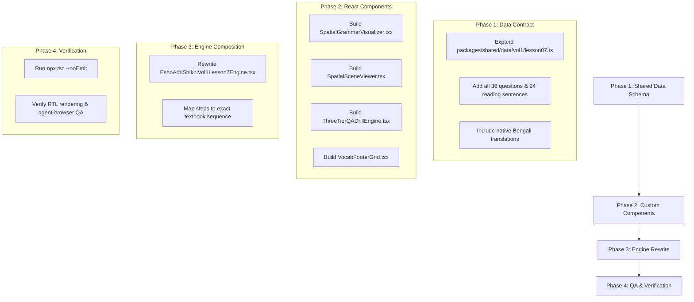

# Comprehensive Pedagogical Audit: Esho Arbi Shikhi (Volume 1, Lesson 7)

**Audit Date**: August 3, 2026  
**Auditor**: Senior Curriculum Architect  
**Subject File**: [EshoArbiShikhiVol1Lesson7Engine.tsx](file:///home/amir/Documents/firstmate/projects%20/a_tariq/apps/web/src/components/curriculum/EshoArbiShikhiVol1Lesson7Engine.tsx)  
**Source Text**: *Esho Arbi Shikhi*, Volume 1, Chapter 2, Lesson 7 (الدرس السابع - সপ্তম পাঠ)  
**Physical Pages Audited**: Book Pages 84, 85, and 86 (File pages: [page-082.png](file:///home/amir/Documents/firstmate/projects%20/a_tariq/resources/pages/vol1/page-082.png), [page-083.png](file:///home/amir/Documents/firstmate/projects%20/a_tariq/resources/pages/vol1/page-083.png), [page-084.png](file:///home/amir/Documents/firstmate/projects%20/a_tariq/resources/pages/vol1/page-084.png))

---

## 1. Executive Summary

A rigorous, line-by-line pedagogical audit was conducted comparing the original textbook *Esho Arbi Shikhi* (Volume 1, Chapter 2, Lesson 7) against the web engine implementation in [`EshoArbiShikhiVol1Lesson7Engine.tsx`](file:///home/amir/Documents/firstmate/projects%20/a_tariq/apps/web/src/components/curriculum/EshoArbiShikhiVol1Lesson7Engine.tsx).

Lesson 7 is the foundational lesson in the *Esho Arbi Shikhi* curriculum introducing **Spatial Adverbs / Locational Prepositions (ظروف المكان)**: `فَوْقَ` (above/on), `تَحْتَ` (under/below), `أَمَامَ` (in front of), and `خَلْفَ` (behind). It teaches students how spatial adverbs force the governing noun into the genitive state (`المجرور بالكسرة`), and establishes the syntactic contrast between indefinite subject fronted predicate sentences (`فَوْقَ الطَّاوِلَةِ كِتَابٌ` - "On the table is a book") and definite subject sentences (`الكِتَابُ فَوْقَ الطَّاوِلَةِ` - "The book is on the table").

### Key Audit Findings

1. **Massive Content Missing & Omission (86% of Q&A Omitted)**:
   - The original textbook contains **36 systematically ordered questions** across 4 distinct visual scene contexts (Table Scene, Ceiling Fan Scene, River/Bridge Scene, and Classroom/Teacher Scene).
   - The current engine includes **only 5 questions**, omitting **31 out of 36 questions (86.1% data loss)**.
   - Core reading sentences (e.g. `فَوْقَ الطَّاوِلَةِ سَاعَةٌ وَ مِسْطَرَةٌ`, `هَذَا الْجِسْرُ جَدِيدٌ - هَذَا الْجِسْرُ طَوِيلٌ جِدًّا`, `هَذَا الزَّوْرَقُ صَغِيرٌ`) are completely missing from the reading drill.

2. **Chronological Distortion & Misordering**:
   - In the textbook, students begin with reading paragraphs paired with visual scene illustrations (Page 84 top). The 4 new vocabulary items (`نَهْرٌ`, `بَحْرٌ`, `جِسْرٌ`, `زَوْرَقٌ`) appear at the bottom footer of Page 84 to assist reading context 3.
   - The current engine forces Vocabulary as **Step 0**, presenting isolated cards before the student sees them in spatial sentences.
   - Furthermore, 17 sentences from 3 entirely different visual contexts (Table, Classroom, River) are mashed into a single flat list.

3. **Inappropriate UI Component Misapplication**:
   - **Forcing `VocabGrid` with Price Tags**: Abstract nouns and adverbs (`مَسَّاحَةٌ`, `جِدًّا`) are rendered in an e-commerce price tag card layout.
   - **Forcing `PointerDrillList` with `distance: near/far`**: Sentences using spatial adverbs (`فَوْقَ` - above, `تَحْتَ` - under) are improperly tagged with `distance: 'near'` or `distance: 'far'`, confusing spatial prepositions with demonstrative pronouns (`هَذَا`/`ذَلِكَ`). Emojis like 🪑, 📚, ⛵ are substituted for actual spatial scene diagrams.
   - **Stripping 3-Tier Question Typology**: The engine reduces all exercise questions to a single chip-selector component, ignoring the textbook's explicit distinction between **General Questions** (`سؤال عام` with `هَلْ`), **Alternative Questions** (`سؤال خاص` with `أ...أَمْ...`), and **Locational Wh- Questions** (`أَيْنَ` / `مَاذَا` / `كَيْفَ`).

4. **Complete Absence of Grammar Rules & Syntactic Highlighting**:
   - The engine contains zero grammar cards explaining `ظروف المكان`, zero visual highlighting of Kasrah on the `مَظْرُوف` (governed noun), and no explanation of the syntactic shift when `خَبَر` (predicate) precedes `مُبْتَدَأ` (subject).

5. **Stripping of Native Bengali Pedagogical Text**:
   - All native Bengali instructions (`ছবি দেখে উত্তর দাও`, `বিভিন্ন বস্তুর দিকে ইশارا করে আরবী বলো`) and Bengali vocabulary glosses (`একটি নদী`, `একটি সাগর`, `একটি পোল`, `একটি নৌকা`) were stripped and replaced with generic English text.

---

## 2. Physical Page Mapping vs Engine Step Mapping

| Book Page | Original Textbook Section / Content | Current Engine Step | Status & Discrepancies |
| :--- | :--- | :--- | :--- |
| **Page 84** (`page-082.png`) | Header & Spatial Grammar Concept | *None (Omitted)* | **Missing**: No grammar card for `ظروف المكان` or `المجرور بالكسرة`. |
| **Page 84** (`page-082.png`) | Section 1: Context 1 Reading (Table Scene) | Step 1: `Reading Prepositions` | **Incomplete**: Omits sentences 4 & 6 (`فَوْقَ الطَّاوِلَةِ سَاعَةٌ...`). |
| **Page 84** (`page-082.png`) | Section 2: Context 2 Reading (Teacher & Board) | Step 1: `Reading Prepositions` | **Incomplete**: Omits sentence 13 & 14 (`فَوْقَ الطَّاوِلَةِ مِسَّاحَةٌ...`). |
| **Page 84-85** (`page-082/083.png`) | Section 3: Context 3 Reading (River & Bridge) | Step 1: `Reading Prepositions` | **Incomplete**: Omits `هَذَا الْجِسْرُ جَدِيدٌ` and `هَذَا الزَّوْرَقُ صَغِيرٌ`. |
| **Page 84** (`page-082.png`) | Section 4: Vocabulary Footer (`نهر`, `بحر`, `جسر`, `زورق`) | Step 0: `New Vocabulary` | **Flawed & Out of Order**: Pushed to Step 0; crams unrelated words; uses price tag grid; removes Bengali. |
| **Page 85-86** (`page-083/084.png`) | Section 5: Exercise 1 (`التمرين الأول`) - Q&A (36 Questions) | Step 2: `Question & Answer` | **Severely Truncated**: Retains only 5 out of 36 questions (86.1% missing); strips 3-tier question typology. |
| **Page 86** (`page-084.png`) | Section 6: Exercise 2 (`التمرين الثاني`) - Practical Spoken Drill | Step 3: `Homework` | **Displaced & Generic**: Replaced by a generic English text box. |

---

## 3. Detailed Line-by-Line Discrepancy Audit

### Section I: Reading Text Context 1 - Table Scene (Book Page 84)

Visual Context in Textbook: Detailed line drawing showing a table with a book, pen, ruler, and watch resting on top, and a schoolbag and umbrella underneath.

```
Textbook Text:
1. هَذِهِ طَاوِلَةٌ .
2. اَلطَّاوِلَةُ كَبِيرَةٌ .
3. فَوْقَ الطَّاوِلَةِ كِتَابٌ وَ قَلَمٌ .
4. فَوْقَ الطَّاوِلَةِ سَاعَةٌ وَ مِسْطَرَةٌ .
5. اَلْكِتَابُ وَ القَلَمُ فَوْقَ الطَّاوِلَةِ .
6. اَلسَّاعَةُ وَ المِسْطَرَةُ فَوْقَ الطَّاوِلَةِ .
7. تَحْتَ الطَّاوِلَةِ حَقِيبةٌ وَ مِظَلَّةٌ .
8. اَلحَقِيبةُ وَ المِظَلَّةُ تَحْتَ الطَّاوِلَةِ .
```

#### Engine Implementation Comparison (Step 1 - `prepositionsDrill` items 1-6)
- **Included**:
  - Item 1: `هَذِهِ طَاوِلَةٌ`
  - Item 2: `الطَّاوِلَةُ كَبِيرَةٌ`
  - Item 3: `فَوْقَ الطَّاوِلَةِ كِتَابٌ وَ قَلَمٌ`
  - Item 4: `الكِتَابُ وَالقَلَمُ فَوْقَ الطَّاوِلَةِ`
  - Item 5: `تَحْتَ الطَّاوِلَةِ حَقِيبةٌ وَ مِظَلَّةٌ`
  - Item 6: `الحَقِيبةُ وَالمِظَلَّةُ تَحْتَ الطَّاوِلَةِ`
- **Omitted**:
  - Item 4 in book: `فَوْقَ الطَّاوِلَةِ سَاعَةٌ وَ مِسْطَرَةٌ .` (Omitting the second pair on top of table)
  - Item 6 in book: `اَلسَّاعَةُ وَ المِسْطَرَةُ فَوْقَ الطَّاوِلَةِ .` (Omitting definite form of second pair)
- **Pedagogical Flaw**: The contrast between pairing (Book + Pen) vs (Watch + Ruler) is vital because it proves to the student that any noun phrase can take the position of `مُبْتَدَأ`. Omitting lines 4 & 6 destroys this pair symmetry.

---

### Section II: Reading Text Context 2 - Teacher & Blackboard Scene (Book Page 84)

Visual Context in Textbook: Line drawing of a male teacher standing at a blackboard with a desk and chair in front of the board, and a duster resting on the desk.

```
Textbook Text:
9.  أَمَامَ المُعَلِّمِ سَبُّورَةٌ .
10. اَلْمُعَلِّمُ أَمَامَ السَّبُّورَةِ .
11. أَمَامَ السَّبُّورَةِ كُرْسِيٌّ وَ طَاوِلَةٌ .
12. اَلْكُرْسِيُّ وَ الطَّاوِلَةُ أَمَامَ السَّبُّورَةِ .
13. فَوْقَ الطَّاوِلَةِ مِسَّاحَةٌ .
14. اَلْمِسَّاحَةُ فَوْقَ الطَّاوِلَةِ .
```

#### Engine Implementation Comparison (Step 1 - `prepositionsDrill` items 7-10)
- **Included**:
  - Item 7: `أَمَامَ المُعَلِّمِ سَبُّورَةٌ`
  - Item 8: `المُعَلِّمُ أَمَامَ السَّبُّورَةِ`
  - Item 9: `أَمَامَ السَّبُّورَةِ كُرْسِيٌّ وَ طَاوِلَةٌ`
  - Item 10: `الكُرْسِيُّ وَالطَّاوِلَةُ أَمَامَ السَّبُّورَةِ`
- **Omitted**:
  - Line 13: `فَوْقَ الطَّاوِلَةِ مِسَّاحَةٌ .` (On the table is an eraser/duster.)
  - Line 14: `اَلْمِسَّاحَةُ فَوْقَ الطَّاوِلَةِ .` (The eraser/duster is on the table.)
- **Pedagogical Flaw**: The omission of lines 13 & 14 removes `مِسَّاحَةٌ` from the reading passage, making its inclusion in Step 0 VocabGrid completely contextless!

---

### Section III: Reading Text Context 3 - River, Bridge, Boat, Car Scene (Book Page 84-85)

Visual Context in Textbook: Line drawing showing a wide river, a arched bridge overhead, a small boat on the water beneath the bridge, and a fast car travelling across the bridge.

```
Textbook Text:
15. هَذَا نَهْرٌ كَبِيرٌ .
16. فَوْقَ النَّهْرِ جِسْرٌ .
17. اَلْجِسْرُ فَوْقَ النَّهْرِ -
18. هَذَا الْجِسْرُ جَدِيدٌ -
19. هَذَا الْجِسْرُ طَوِيلٌ جِدًّا .
20. تَحْتَ الْجِسْرِ زَوْرَقٌ .
21. اَلزَّوْرَقُ تَحْتَ الْجِسْرِ -
22. هَذَا الزَّوْرَقُ صَغِيرٌ .
23. فَوْقَ الْجِسْرِ سَيَّارَةٌ -
24. هَذِهِ سَيَّارَةٌ سَرِيعَةٌ جِدًّا .
```

#### Engine Implementation Comparison (Step 1 - `prepositionsDrill` items 11-17)
- **Included**:
  - Item 11: `هَذَا نَهْرٌ كَبِيرٌ`
  - Item 12: `فَوْقَ النَّهْرِ جِسْرٌ`
  - Item 13: `الجِسْرُ فَوْقَ النَّهْرِ`
  - Item 14: `تَحْتَ الجِسْرِ زَوْرَقٌ`
  - Item 15: `الزَّوْرَقُ تَحْتَ الجِسْرِ`
  - Item 16: `فَوْقَ الجِسْرِ سَيَّارَةٌ`
  - Item 17: `هَذِهِ سَيَّارَةٌ سَرِيعَةٌ جِدًّا`
- **Omitted**:
  - Line 18: `هَذَا الْجِسْرُ جَدِيدٌ -` (This bridge is new -)
  - Line 19: `هَذَا الْجِسْرُ طَوِيلٌ جِدًّا .` (This bridge is very long.)
  - Line 22: `هَذَا الزَّوْرَقُ صَغِيرٌ .` (This boat is small.)
- **Pedagogical Flaw**: The textbook uses compound clauses connected by dashes (`-`) to expand descriptive attributes (`جديد`, `طويل جدا`, `صغير`). Stripping these descriptive clauses reduces rich language practice to bare spatial locators.

---

### Section IV: Vocabulary Box (Page 84 Footer)

#### Textbook Vocabulary Box (Page 84 Bottom):
- `نَهْرٌ` : একটি নদী (A river)
- `بَحْرٌ` : একটি সমুদ্র (A sea)
- `جِسْرٌ` : একটি পول / সেতু (A bridge)
- `زَوْرَقٌ` : একটি নৌকা (A boat)

#### Engine Implementation Comparison (Step 0 - `vocabItems`)
```typescript
const vocabItems: VocabItem[] = [
  { id: 1, ar: 'نَهْرٌ', en: 'A river', roman: 'nahrun' },
  { id: 2, ar: 'بَحْرٌ', en: 'A sea', roman: 'bahrun' },
  { id: 3, ar: 'جِسْرٌ', en: 'A bridge', roman: 'jisrun' },
  { id: 4, ar: 'زَوْرَقٌ', en: 'A boat', roman: 'zawraqun' },
  { id: 5, ar: 'مَسَّاحَةٌ', en: 'An eraser / duster', roman: 'massaahatun' },
  { id: 6, ar: 'جِدًّا', en: 'Very', roman: 'jiddan' }
];
```
- **Discrepancies**:
  1. **Injected Words**: Injected `مَسَّاحَةٌ` and `جِدًّا` into the initial vocab box, whereas the textbook had only 4 nouns in the Page 84 footer box.
  2. **Stripped Bengali**: Bengali translations (`একটি নদী`, `একটি সমুদ্র`, `একটি সেতু`, `একটি নৌকা`) were completely removed.
  3. **Visual Aesthetics**: Forced into `VocabGrid` which renders price-tag badges (`Tag` icon), inappropriate for vocabulary learning without images or prices.

---

### Section V: Exercise 1 (`التمرين الأول`) - Comprehensive Question & Answer Audit

Sub-instruction in Textbook: `ছবি দেখে উত্তর দাও ।` (*Look at the picture and answer.*)

The textbook features **36 distinct questions** grouped under 4 visual illustrations. Below is the complete audit of all 36 questions versus the engine's 5 questions:

#### Scene A: Questions on Illustration 1 (Table Scene - 10 Questions)
| # | Textbook Question | Type | In Current Engine? | Status |
| :-: | :--- | :--- | :-: | :--- |
| 1 | `هَلْ فَوْقَ الطَّاوِلَةِ سَاعَةٌ وَ مِسْطَرَةٌ ؟` | General (`هل`) | ❌ No | **Omitted** |
| 2 | `أَ كِتَابٌ فَوْقَ الطَّاوِلَةِ أَمْ كُرَّاسَةٌ ؟` | Alternative (`أ...أم`) | ❌ No | **Omitted** |
| 3 | `أَ قَلَمٌ فَوْقَ الطَّاوِلَةِ أَمْ مِفْتَاحٌ ؟` | Alternative (`أ...أم`) | ❌ No | **Omitted** |
| 4 | `مَاذَا فَوْقَ الطَّاوِلَةِ ؟` | Wh- (`ماذا`) | ✅ Yes (Step 2, Q1) | Included |
| 5 | `أَ سَاعَةٌ فَوْقَهَا أَمْ نَظَّارَةٌ ؟` | Alternative (`أ...أم`) | ❌ No | **Omitted** |
| 6 | `هَلِ الْكِتَابُ وَ القَلَمُ فَوْقَ الطَّاوِلَةِ ؟` | General (`هل`) | ❌ No | **Omitted** |
| 7 | `أَيْنَ الْكِتَابُ وَ القَلَمُ ؟` | Wh- (`أين`) | ❌ No | **Omitted** |
| 8 | `أَ فَوْقَ الطَّاوِلَةِ الْكِتَابُ وَ القَلَمُ أَمْ تَحْتَهَا ؟` | Alternative (`أ...أم`) | ❌ No | **Omitted** |
| 9 | `أَيْنَ السَّاعَةُ وَ الْمِسْطَرَةُ ؟` | Wh- (`أين`) | ✅ Yes (Step 2, Q2) | Included |
| 10 | `أَ تَحْتَ الطَّاوِلَةِ السَّاعَةُ وَ الْمِسْطَرَةُ أَمْ فَوْقَهَا ؟` | Alternative (`أ...أم`) | ❌ No | **Omitted** |

#### Scene B: Questions on Illustration 2 (Ceiling Fan Scene - 4 Questions)
| # | Textbook Question | Type | In Current Engine? | Status |
| :-: | :--- | :--- | :-: | :--- |
| 11 | `مَاذَا تَحْتَ السَّقْفِ ؟` | Wh- (`ماذا`) | ✅ Yes (Step 2, Q3) | Included |
| 12 | `أَ مَرُّوَحَةٌ تَحْتَ السَّقْفِ أَمْ مِصْبَاحٌ ؟` | Alternative (`أ...أم`) | ❌ No | **Omitted** |
| 13 | `أَيْنَ الْمِرْوَحَةُ ؟` | Wh- (`أين`) | ❌ No | **Omitted** |
| 14 | `أَ فَوْقَ السَّقْفِ هِيَ أَمْ تَحْتَ السَّقْفِ ؟` | Alternative (`أ...أم`) | ❌ No | **Omitted** |

#### Scene C: Questions on Illustration 3 (River / Bridge / Boat / Car Scene - 12 Questions)
| # | Textbook Question | Type | In Current Engine? | Status |
| :-: | :--- | :--- | :-: | :--- |
| 15 | `مَاذَا فَوْقَ النَّهْرِ ؟` | Wh- (`ماذا`) | ❌ No | **Omitted** |
| 16 | `أَيْنَ الْجِسْرُ ؟` | Wh- (`أين`) | ❌ No | **Omitted** |
| 17 | `كَيْفَ الْجِسْرُ ؟` | Wh- (`كيف`) | ❌ No | **Omitted** |
| 18 | `أَ طَوِيلٌ هَذَا الْجِسْرُ ؟` | General (`أ`) | ❌ No | **Omitted** |
| 19 | `أَ جَدِيدٌ هَذَا الْجِسْرُ أَمْ قَدِيمٌ ؟` | Alternative (`أ...أم`) | ❌ No | **Omitted** |
| 20 | `مَاذَا فَوْقَ الْجِسْرِ ؟` | Wh- (`ماذا`) | ❌ No | **Omitted** |
| 21 | `أَيْنَ السَّيَّارَةُ ؟` | Wh- (`أين`) | ❌ No | **Omitted** |
| 22 | `هَلْ هِيَ سَيَّارَةٌ سَرِيعَةٌ جِدًّا ؟` | General (`هل`) | ❌ No | **Omitted** |
| 23 | `مَاذَا تَحْتَ الْجِسْرِ ؟` | Wh- (`ماذا`) | ❌ No | **Omitted** |
| 24 | `أَيْنَ الزَّوْرَقُ ؟` | Wh- (`أين`) | ✅ Yes (Step 2, Q5) | Included |
| 25 | `أَ تَحْتَ الْجِسْرِ الزَّوْرَقُ أَمْ فَوْقَهُ ؟` | Alternative (`أ...أم`) | ❌ No | **Omitted** |
| 26 | `أَ صَغِيرٌ هَذَا الزَّوْرَقُ أَمْ كَبِيرٌ ؟` | Alternative (`أ...أم`) | ❌ No | **Omitted** |

#### Scene D: Questions on Illustration 4 (Teacher / Blackboard Scene - 10 Questions)
| # | Textbook Question | Type | In Current Engine? | Status |
| :-: | :--- | :--- | :-: | :--- |
| 27 | `مَا تِلْكَ ؟` | Wh- (`ما`) | ❌ No | **Omitted** |
| 28 | `مَنْ أَمَامَ السَّبُّورَةِ ؟` | Wh- (`من`) | ❌ No | **Omitted** |
| 29 | `أَيْنَ الْمُعَلِّمُ ؟` | Wh- (`أين`) | ✅ Yes (Step 2, Q4) | Included |
| 30 | `أَ أَمَامَ السَّبُّورَةِ هُوَ أَمْ خَلْفَهَا ؟` | Alternative (`أ...أم`) | ❌ No | **Omitted** |
| 31 | `مَاذَا أَمَامَ السَّبُّورَةِ ؟` | Wh- (`ماذا`) | ❌ No | **Omitted** |
| 32 | `أَيْنَ الْكُرْسِيُّ وَ الطَّاوِلَةُ ؟` | Wh- (`أين`) | ❌ No | **Omitted** |
| 33 | `مَاذَا فَوْقَ الطَّاوِلَةِ ؟` | Wh- (`ماذا`) | ❌ No | **Omitted** |
| 34 | `أَ مِسَّاحَةٌ فَوْقَهَا أَمْ مِسْطَرَةٌ ؟` | Alternative (`أ...أم`) | ❌ No | **Omitted** |
| 35 | `أَيْنَ الْمِسَّاحَةُ ؟` | Wh- (`أين`) | ❌ No | **Omitted** |
| 36 | `أَ فَوْقَ الطَّاوِلَةِ هِيَ أَمْ تَحْتَهَا ؟` | Alternative (`أ...أم`) | ❌ No | **Omitted** |

#### Summary of Question Omissions
- **Total Questions in Textbook**: 36
- **Total Questions in Code**: 5
- **Omission Rate**: 31 questions missing (86.1%)
- **Alternative Choice (`أ...أَمْ...`) Questions**: 12 in book, **0 in code**. The entire pedagogical system of teaching binary choice questions is omitted!

---

### Section VI: Exercise 2 (`التمرين الثاني`) - Practical Spoken Drill (Book Page 86)

```
Textbook Text:
التمرين الثاني
বিভিন্ন বস্তুর দিকে ইশারা করে আরবী বলো ।
(Point to different objects and speak Arabic.)
```

#### Engine Treatment
- Omitted entirely as a practical drill.
- Step 3 ("Homework") replaces it with a static, hardcoded text paragraph in English:
  `"Practice reading aloud the questions and answers. Look at objects around you and try to describe their positions..."`

---

## 4. Custom React Component Proposals & Redesign

To eliminate generic card placeholders, price tags, and truncated lists, we propose 4 bespoke React components designed specifically for Lesson 7's spatial grammar and multi-scene pedagogical requirements.

### Proposal 1: `SpatialGrammarRuleCard` (`SpatialGrammarVisualizer.tsx`)
A custom component to introduce Spatial Adverbs (`ظروف المكان`) before students read the passages.

```tsx
interface SpatialAdverb {
  adverbAr: string;        // e.g. 'فَوْقَ'
  adverbBn: string;        // e.g. 'উপরে'
  adverbEn: string;        // e.g. 'Above / On'
  exampleAr: string;       // e.g. 'فَوْقَ الطَّاوِلَةِ كِتَابٌ'
  governedNounAr: string;  // e.g. 'الطَّاوِلَةِ' (highlighting Kasrah on final letter)
  syntacticNoteBn: string; // e.g. 'ظرف المكان (فَوْقَ) এর পরবর্তী اسم টি مجرور (কাসরা যুক্ত) হয়।'
}
```
*Visual Features*:
- Interactive spatial diagram showing 4 direction badges: `فَوْقَ` (top), `تَحْتَ` (bottom), `أَمَامَ` (front), `خَلْفَ` (back).
- Color-coded grammatical highlight: Adverb in Amber, Governed Noun (`المجرور`) in Emerald with animated ring around the Kasrah.

---

### Proposal 2: `SpatialSceneViewer` (`SpatialSceneViewer.tsx`)
Replaces `PointerDrillList` for spatial reading passages. Instead of scrolling through 17 flat text rows with arbitrary price-tag emojis, students select from 3 visual scenes:
1. **Scene 1: Table Scene** (`الطاولة والأشياء`)
2. **Scene 2: Classroom Scene** (`المعلم والسبورة`)
3. **Scene 3: River & Bridge Scene** (`النهر والجسر والزورق والسيارة`)

```tsx
interface SpatialScene {
  id: string;
  titleAr: string;
  titleBn: string;
  illustrationPath: string; // SVG/Canvas illustration of the scene
  sentences: Array<{
    id: number;
    arabicText: string;
    bengaliTranslation: string;
    englishTranslation: string;
    targetPreposition: 'فَوْقَ' | 'تَحْتَ' | 'أَمَامَ' | 'خَلْفَ';
    spatialHighlightRange: [number, number];
  }>;
}
```
*Visual Features*:
- Split-screen layout: Interactive visual scene diagram on the left; sentence reading cards on the right.
- Clicking an object in the scene diagram (e.g. the boat under the bridge) auto-scrolls to and highlights the corresponding sentence (`تَحْتَ الجِسْرِ زَوْرَقٌ`).

---

### Proposal 3: `ThreeTierQADrillEngine` (`ThreeTierQADrillEngine.tsx`)
Replaces `InteractiveDrill` to handle all 36 questions across the 4 scene contexts with full support for the 3 question typologies:

```tsx
type QuestionCategory = 'general_hal' | 'alternative_am' | 'wh_spatial';

interface SpatialQuestion {
  id: number;
  sceneId: 'table' | 'ceiling' | 'river' | 'classroom';
  category: QuestionCategory;
  questionAr: string;
  questionBn: string;
  optionsAr?: string[];           // For alternative questions (أ...أم...)
  correctAnswerAr: string;
  correctAnswerBn: string;
  explanationBn: string;
}
```
*Visual Features*:
- **Header Badge**: Displays question category indicator:
  - `سؤال عام (نعم / لا)` (General Confirmations)
  - `سؤال خاص (أ...أم...)` (Binary Alternative Choice)
  - `سؤال مكان (أين / ماذا / كيف / من)` (Locational Wh- Answer)
- **Scene Mini-Map**: Displays the relevant scene diagram above the question box so students answer based on visual evidence.
- Full support for cycling through all 36 questions with progress indicator (`Question X of 36`).

---

### Proposal 4: `VocabFooterGrid` (`VocabFooterGrid.tsx`)
A minimal, elegant vocabulary bar matching the physical book layout at the bottom of Page 84.

```tsx
interface VocabItem {
  ar: string;
  bn: string;
  en: string;
  phonetic: string;
}
```
*Visual Features*:
- Clean, non-commercial card layout without price tags or e-commerce badges.
- Dual Bengali + English translation display.
- Audio play button for native pronunciation.

---

## 5. Architectural Refactoring & Action Plan

To rectify all findings, the following phased execution plan is recommended:



### Next Steps & Action Items
1. **Update Shared Data**: Create/update `packages/shared/data/vol1/lesson07.ts` containing the complete 36-question dataset, all 24 reading lines, and 4 core vocabulary items with Bengali glosses.
2. **Implement Proposed Components**: Build `SpatialGrammarVisualizer.tsx`, `SpatialSceneViewer.tsx`, and `ThreeTierQADrillEngine.tsx` in `apps/web/src/components/curriculum/shared/`.
3. **Refactor Engine**: Overhaul `EshoArbiShikhiVol1Lesson7Engine.tsx` to follow the exact physical book progression (Grammar -> Scene Reading -> Vocabulary Footer -> 36-Question Drill -> Spoken Application).
4. **Validation**: Validate zero TypeScript errors (`npx tsc --noEmit`) and verify visual layout via `agent-browser`.

---
*Report compiled and saved to [`docs/audits/Lesson7_Audit.md`](file:///home/amir/Documents/firstmate/projects%20/a_tariq/docs/audits/Lesson7_Audit.md).*
