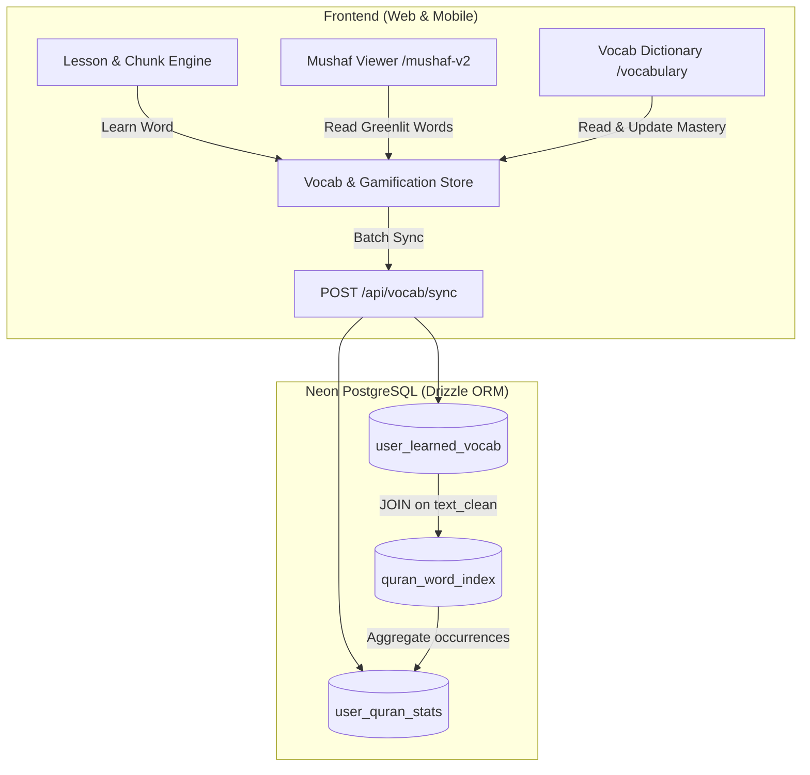

# PostgreSQL Implementation & Quran Mushaf Integration Architecture

This document provides the complete, production-ready specification and migration roadmap for persisting **learned vocabulary**, computing **live Quran word comprehension percentages**, and dynamically **greenlighting words on the 604-page Mushaf Viewer**.

---

## 1. System Architecture Diagram



---

## 2. PostgreSQL Relational Schema (`src/db/schema.ts`)

### `users`
Tracks core learner profile, gamification levels, streaks, and timestamps.
- `id` (UUID, Primary Key, default `gen_random_uuid()`)
- `username` (Text)
- `xp` (Integer, default 0)
- `coins` (Integer, default 0)
- `streak` (Integer, default 1)
- `best_streak` (Integer, default 1)
- `last_active_date` (Date)
- `created_at`, `updated_at` (Timestamps with time zone)

### `daily_quests`
Dynamic daily tasks (e.g. Learn 10 words, 5 practice streak, Tarteel pronunciation).
- `id` (Serial, Primary Key)
- `user_id` (UUID, Foreign Key $\rightarrow$ `users.id`)
- `quest_date` (Date, e.g. `2026-09-16`)
- `task_id` (Text: `'learn_10_words'`, `'practice_5_streak'`, `'tarteel_pronunciation'`, `'lesson_comprehension'`)
- `current_count` (Integer)
- `target_count` (Integer)
- `is_completed` (Boolean)
- `is_claimed` (Boolean)
- `xp_reward` (Integer)
- **Constraint**: `UNIQUE(user_id, quest_date, task_id)`

### `user_learned_vocab`
Learner's active vocabulary inventory with Spaced Repetition (SRS) parameters.
- `id` (Serial, Primary Key)
- `user_id` (UUID, Foreign Key $\rightarrow$ `users.id`)
- `word_ar` (Text, with harakat e.g. `كِتَابٌ`)
- `word_clean` (Text, normalized without diacritics e.g. `كتاب` for fast indexing)
- `meaning_en` (Text)
- `volume_id` (Integer)
- `lesson_id` (Integer)
- `mastery_level` (Text: `'learning'`, `'familiar'`, `'mastered'`)
- `srs_interval` (Integer, days between reviews)
- `srs_ease_factor` (Real, default 2.5)
- `review_count` (Integer, default 0)
- `next_review_at` (Timestamp with time zone)
- `last_reviewed_at` (Timestamp with time zone)
- **Constraint**: `UNIQUE(user_id, word_clean)`
- **Indices**: `(user_id, word_clean)`, `(word_clean)`, `(user_id, volume_id, lesson_id)`

### `quran_word_index`
Pre-indexed static catalog of the complete 77,430 word tokens in the Holy Quran (King Fahd Complex Madani Mushaf).
- `id` (Serial, Primary Key)
- `surah` (Integer: 1..114)
- `ayah` (Integer)
- `position` (Integer: word index within ayah)
- `page_number` (Integer: 1..604)
- `line_number` (Integer: 1..15)
- `text_uthmani` (Text: exact Uthmanic Hafs glyph)
- `text_clean` (Text: normalized lemma/surface form for matching)
- `root` (Text, e.g. `ك-ت-ب`)
- `lemma` (Text, e.g. `كِتَاب`)
- `translation_en` (Text)
- `frequency_in_quran` (Integer: total occurrences across the 6,236 ayat)
- **Indices**: `(text_clean)`, `(page_number, line_number)`, `(surah, ayah)`

### `user_quran_stats` (Materialized Progress Cache)
Maintains instant access to the learner's Quran comprehension percentage without scanning 77,430 rows on every request.
- `user_id` (UUID, Foreign Key $\rightarrow$ `users.id`, Unique)
- `total_words_unlocked` (Integer, e.g. `3,250`)
- `percentage_unlocked` (Real, e.g. `4.2%`)
- `mastered_words_count` (Integer)
- `last_synced_at` (Timestamp with time zone)

---

## 3. High-Performance SQL Queries

### A. Calculate Unlocked Quran Words Percentage
```sql
SELECT
    COUNT(q.id) AS total_unlocked_occurrences,
    ROUND((COUNT(q.id)::numeric / 77430.0) * 100, 2) AS percentage_unlocked
FROM quran_word_index q
JOIN user_learned_vocab v
    ON q.text_clean = v.word_clean
WHERE v.user_id = $1;
```

### B. Fetch Greenlit Words for Mushaf Page $N
```sql
SELECT
    q.page_number,
    q.line_number,
    q.position,
    q.text_uthmani,
    v.word_ar,
    v.meaning_en,
    v.volume_id,
    v.lesson_id,
    v.mastery_level
FROM quran_word_index q
JOIN user_learned_vocab v
    ON q.text_clean = v.word_clean
WHERE v.user_id = $1
  AND q.page_number = $2;
```

---

## 4. Migration & Execution Strategy

1. **Local Migration Generation**:
   ```bash
   pnpm --filter web run db:generate
   ```
2. **Apply to PostgreSQL (Neon / Supabase)**:
   ```bash
   pnpm --filter web run db:push
   ```
3. **Seed Quran Word Index**:
   Run a one-time migration script `scripts/seed_quran_index.ts` populating the `quran_word_index` using Quran.com's morphology API or Quranic Arabic Corpus token dataset.
4. **Client-Side Offline First**:
   The web application uses the client-side Zustand store (`vocabStore.ts` & `gamificationStore.ts`) for zero-latency UI updates, background syncing to PostgreSQL whenever network connectivity is active.
